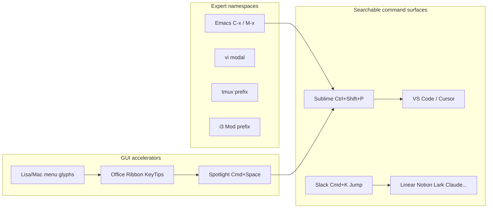
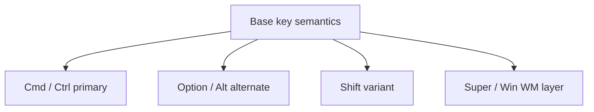

People who fall for Cmd+K / Ctrl+K are rarely celebrating “one more feature.” They are celebrating a surface that suddenly behaves like a **searchable command table**. Claude, Cursor, Feishu/Lark, and Slack all fight for that chord. tmux, vim, Emacs, and i3 treated the keyboard as a **namespace** much earlier. This essay treats shortcuts as a *system*: how the lineage grew, why many apps share the same mental models, and why tools like [KeyCombiner](https://keycombiner.com/collections/) turn “memorizing bindings” into something you can practice.

Written for heavy PC users who bounce between Linux, macOS, and Windows — and who already enjoy tmux, vim/Emacs, and tiling WMs.

## A spine before the details

Two evolutionary lines meet at the command palette / Command K:

Hold three claims:

1. **Expert systems** expand capacity with prefixes and modes (few keys, dense meaning).
2. **GUI systems** expose accelerators through menu glyphs, Ribbon KeyTips, and OS search.
3. **Command palettes** make “I remember the name, not the location” first-class — then merge with Slack’s popularized Cmd+K Jump.

Chris Coyier’s useful split for any command bar: **Run / Jump / Search** ([Command Bars](https://chriscoyier.net/2022/12/18/command-bars/)). Maggie Appleton frames Cmd+K as a summonable CLI inside a GUI ([Command K Bars](https://maggieappleton.com/command-bar)).

## History: macros and modes → menus → Spotlight → palettes

### Emacs: macros that became a command language

Emacs comes from Editing MACroS. On the 1970s MIT AI Lab TECO stack, user experimentation piled up macros; Stallman, Steele, and others amalgamated prior packages into EMACS. The durable design moves are:

- **C-x** as a file/window-class prefix (C-x C-s, C-x C-f stayed stable for decades).
- **M-x (execute-extended-command)**: invoke a command by name — the direct ancestor of “search, then run.”

Sources: [CHM Emacs collection](https://softwarepreservation.computerhistory.org/emacs/), Stallman’s recollection ([lysator](http://www.lysator.liu.se/history/garb/txt/87-1-emacs.txt)), Digital Seams on M-x vs command bars ([Why Ctrl+Shift+P](https://digitalseams.com/blog/why-do-sublime-text-and-vs-code-use-ctrl-shift-p-for-the-command-bar)).

### vi: modality as bandwidth optimization

Bill Joy and collaborators pushed em/en/ex into visual mode; 2BSD (1979) cemented `vi`. Modes were a practical answer to slow terminals: spend keystrokes on dense commands. Joy later contrasted that with Emacs’ modeless, programmable style.

Sources: [vi](https://en.wikipedia.org/wiki/Vi_(editor)), [Joy interview archive](https://web.archive.org/web/20120108175421/web.cecs.pdx.edu/~kirkenda/joy84.html).

vim/Neovim inherit operator+motion grammar (`dw`, `c$`) — a small compositional language, not a flat hotkey list.

### Xerox Star vs Lisa/Mac: discoverability of accelerators

Xerox Star leaned on dedicated function keys and property sheets more than Command-key menu equivalents. Apple Lisa’s UI standards (~1980) fixed the pattern Mac still teaches: menu bar + pull-downs, **APPLE key + letter**, with the glyph shown *in the menu*. Accelerators must be visible while you learn.

Sources: [Lisa UI Standards](https://guidebookgallery.org/articles/lisauserinterfacestandards), [Star UI overview](https://guidebookgallery.org/articles/thestaruserinterfaceanoverview).

### Office Ribbon: discover features without deleting muscle memory

Office 2007 replaced menus/toolbars with the Ribbon for discoverability, but kept Ctrl+S / Ctrl+B-class memory and added **Alt KeyTips** overlays — plus transitional Alt sequences. Discovery path and expert path can coexist.

Sources: [Stroking the Keys](https://learn.microsoft.com/en-us/archive/blogs/jensenh/stroking-the-keys-in-office-12), [KeyTips docs](https://learn.microsoft.com/en-us/previous-versions/office/developer/office-2007/aa338198(v=office.12)).

### Spotlight: OS-level Jump/Search

Mac OS X 10.4 Tiger (2005) shipped Spotlight: **Cmd+Space** for the menu, **Option+Cmd+Space** for the full window. LaunchBar (1996, NeXTSTEP) and kin were precursors. A generation learned: you need not remember which folder held the icon.

Sources: [Apple Tiger preview](https://www.apple.com/uk/newsroom/2004/06/28Apple-Previews-Mac-OS-X-Tiger/), [Macworld Spotlight](https://www.macworld.com/article/175478/tigerspotlight.html).

### Editor command palettes: Sublime → VS Code → Cursor

Jon Skinner’s Sublime Command Palette (~2011) cites precedents such as Mac menu search. The binding landed on **Ctrl/Cmd+Shift+P** because Print was disposable; Ctrl/Cmd+P stayed Goto File. VS Code kept the same culture. Cursor keeps Cmd+Shift+P for the palette and often uses **Cmd+K** as a chord leader for inline AI / terminal prompts — deliberately not the palette key.

Sources: [Sublime Text 2 beta](https://www.sublimetext.com/blog/articles/sublime-text-2-beta), [Digital Seams](https://digitalseams.com/blog/why-do-sublime-text-and-vs-code-use-ctrl-shift-p-for-the-command-bar), [VS Code UI](https://code.visualstudio.com/docs/getstarted/userinterface), [Cursor shortcuts](https://cursor.com/docs/reference/keyboard-shortcuts).

Precision: Sublime did not “invent” command palettes; it popularized the editor pattern and the Shift+P binding culture. Skinner himself pointed at earlier search-in-menus ideas.

### Cmd+K: an almost accidental standard

In Word-class apps, Ctrl+K long meant “insert hyperlink.” A second semantic line came from Slack.

In 2014, Ben van Enckevort demoed a Slack Quick Switcher on a hack day. Common chords were taken; he picked **K** nearly arbitrarily. Slack shipped Quick Switcher with Cmd/Ctrl+K. Slack’s reach exported **K = in-app Jump** into startup products: Linear’s command menu, Notion/Lark search jumpers, and today’s AI “omniboxes.”

Sources: Ben’s answer on [UX Stack Exchange](https://ux.stackexchange.com/questions/153299/how-did-cmd-k-come-to-be-the-standard-shortcut-for-both-adding-a-hyperlink-and-o), [Slack Engineering](https://slack.engineering/a-faster-smarter-quick-switcher/), [Linear docs](https://linear.app/docs/creating-issues), [Lark shortcuts](https://www.larksuite.com/hc/en-US/articles/400301636110-use-keyboard-shortcuts-in-the-lark-desktop-app).

Conflict map today: same physical key means link, jump, chord leader, or AI prompt depending on app. Standardization follows **popularity paths**, not a conflict-free ideal table.

<!-- interactive:conflict-map title="Conflict map for K" caption="the tags beside each app: one physical K means link, jump, chord leader or AI prompt, and on the last row the same chord opens this site's search." alt="Five rows, one per context, with a K keycap beside the selected row. Word-class apps: Ctrl+K inserts a hyperlink. Slack: Cmd/Ctrl+K opens Quick Switcher, an in-app Jump, picked nearly arbitrarily at a 2014 hack day because common chords were taken and carried to Linear's command menu, Notion and Lark search jumpers, and AI omniboxes. VS Code: Ctrl+K is the first half of a chord such as Ctrl+K Ctrl+S. Cursor: Cmd+K is often a chord leader for inline AI and terminal prompts. This site: Cmd/Ctrl+K opens search. The keycap rests on Slack." model="Apps, chords and meanings as the essay prints them in its editor palette and Cmd+K sections and its pattern table. The last row describes this site's search, not a claim from the essay." -->

## Design vocabulary: one grammar under many skins

### Modifier layers

Treat modifiers as layer selectors:

macOS keeps Command primary; Option for alternates; Control carefully. Cross-platform apps map **Cmd ↔ Ctrl**. Window managers (i3/sway) prefer **Mod4=Super** to avoid fighting app Alt bindings.

### Simultaneous chord, sequential chord, prefix, modal

| Pattern | Example | Property |
| --- | --- | --- |
| Simultaneous chord | Cmd+S | Hold modifiers + key |
| Sequential chord | VS Code Ctrl+K Ctrl+S; Emacs C-x C-s | First key occupies binding space |
| Prefix mode | tmux Ctrl-b; Screen Ctrl-a; i3 `$mod` | Leader, then command |
| Modal state | vim Normal/Insert; i3 binding modes | State until exit |

VS Code chords buy namespace at the cost that the first half cannot also be a standalone command.

### Discoverability vs speed

Nielsen Norman Group frames shortcuts as **accelerators**: expert parallel paths, not the only path — reveal them via menus, tooltips, just-in-time tips, cheat sheets ([UI Accelerators](https://www.nngroup.com/articles/ui-accelerators/)).

Command palettes sit in the middle: remember the concept, not the menu path or the exact chord.

### Muscle memory across OSes

Semantic transfer (save, copy, command box) is robust; physical modifiers (Mac Control vs Windows Ctrl, Alt vs Option, Super vs Win) are brittle. Products that document `cmd/ctrl` dual notation are admitting dual-OS reality.

## Expert ecosystems: the shared idea is a prefix tree

i3, tmux, vim, and Emacs are isomorphic to Cmd+K products at one level: they maintain a **command prefix tree**.

<!-- interactive:prefix-tree title="Different roots, one structure" caption="the Waiting column: Ctrl+K, C-x, M-x, Ctrl-b and the palette all stop there for the next key, Cmd+S never does, and vim starts from Normal rather than the root." alt="Rows that hang off one namespace root, in columns for Waiting and Command. Cmd+S goes straight to a command. VS Code Ctrl+K then Ctrl+S, Emacs C-x then C-s, Emacs M-x then a name, tmux Ctrl-b then a command, and the Command Palette then a name all stop in Waiting first. Pressing tmux Ctrl-b twice sends a literal Ctrl-b. vim starts from Normal, where d then w and c then $ stop in Waiting. The i3 row lists $mod + letter and binding modes. The marker rests on VS Code Ctrl+K, waiting for the second key." model="Keys and patterns come from the pattern table, the Emacs, vim and tmux notes and the prefix tree list. Dashed keys are ones the essay does not name, and no command name appears that the essay does not give." -->

- **tmux**: default prefix Ctrl-b (avoids Screen’s Ctrl-a and Emacs/readline Ctrl-a). Double prefix sends a literal Ctrl-b ([Getting Started](https://github.com/tmux/tmux/wiki/Getting-Started)).
- **i3 / sway**: `$mod` + letter; binding modes swap temporary maps; dmenu is a mini palette ([i3 guide](https://i3wm.org/docs/userguide.html)).
- **vim**: modes as a state machine; Normal grammar is compositional.
- **Emacs**: Ctrl/Meta layers + prefixes + M-x name space; extreme extensibility with a surprisingly stable core.

If “memorizing shortcuts feels fun” after Unix tools, it is usually because you are learning **spatial grammar** — where the prefix lives, how layers cut, when modes flip — not a pile of unrelated hotkeys.

## KeyCombiner: shortcuts as a practice system

[KeyCombiner](https://keycombiner.com/) (Thomas Kainrad) is not another PDF cheat sheet. It models shortcuts as:

1. **Public libraries** (VS Code, Vim, IntelliJ, Gmail, Notion, Excel, …).
2. **Personal collections** — curated playlists ([collections](https://keycombiner.com/collections/)).
3. **Spaced-repetition practice** with confidence from speed/errors.
4. **Desktop lookup** for the frontmost app (see site for the default chord).

That is shortcut-as-system thinking: inventory, curation, practice, lookup. Same pleasure as learning tmux/vim/i3, pointed at every GUI app. FAQ: [keycombiner.com/faq](https://keycombiner.com/faq/).

## Mental models worth drawing

1. **Run / Jump / Search** (Coyier) — diagnose any Cmd+K by job mix; mixed bars need careful ranking.
2. **Accelerator ladder** — click → menu glyph → tooltip → palette → memorized chord.
3. **Prefix tree** — C-x, tmux prefix, Ctrl+K chords, i3 `$mod`, palette text box are different roots of one structure.
4. **Conflict map** — K as link / jump / chord leader / AI.
5. **Cmd+Space vs Cmd+K** — OS/global context vs in-app context.

Implementation zoo: [awesome-command-palette](https://github.com/stefanjudis/awesome-command-palette).

## A practical closing for dual-OS power users

If you already live in tmux + vim/Emacs + i3, Cursor/Claude/Lark command boxes are not a new skill tree. Unify a personal prefix philosophy:

- OS search for system jump (Spotlight / launcher).
- Prefer Cmd/Ctrl+K or Shift+P inside apps; first ask whether it is Jump or Run.
- Keep high-density work in modal/prefix systems; use GUI palettes for discovery and occasional cross-app jumps.
- Make “what I am currently practicing” explicit (KeyCombiner-style collections) so you do not stall forever on copy/paste only.

A Chinese version of this essay is available via the language switch above.

## Short source list

- Stallman Emacs history: http://www.lysator.liu.se/history/garb/txt/87-1-emacs.txt
- Joy vi interview: https://web.archive.org/web/20120108175421/web.cecs.pdx.edu/~kirkenda/joy84.html
- Lisa / Star UI: guidebookgallery articles above
- Office KeyTips: https://learn.microsoft.com/en-us/archive/blogs/jensenh/stroking-the-keys-in-office-12
- Spotlight: Apple Tiger preview
- Sublime / Shift+P: https://digitalseams.com/blog/why-do-sublime-text-and-vs-code-use-ctrl-shift-p-for-the-command-bar
- Cmd+K origin (Ben): https://ux.stackexchange.com/questions/153299/how-did-cmd-k-come-to-be-the-standard-shortcut-for-both-adding-a-hyperlink-and-o
- Appleton: https://maggieappleton.com/command-bar
- Coyier: https://chriscoyier.net/2022/12/18/command-bars/
- NN/g: https://www.nngroup.com/articles/ui-accelerators/
- i3: https://i3wm.org/docs/userguide.html
- KeyCombiner: https://keycombiner.com/
