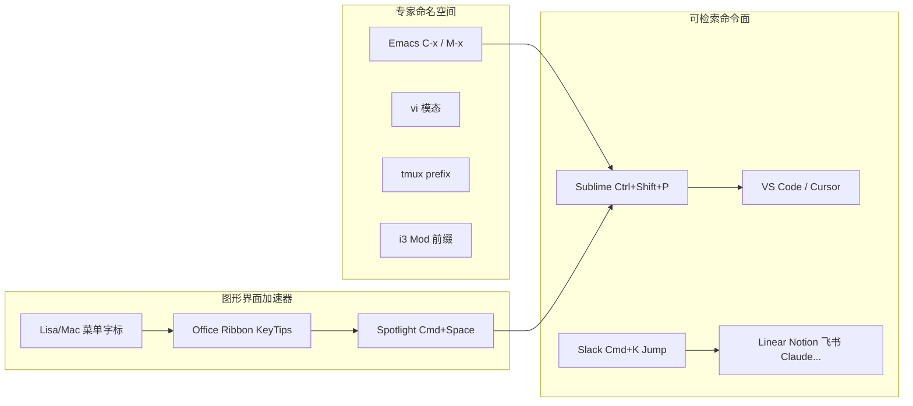
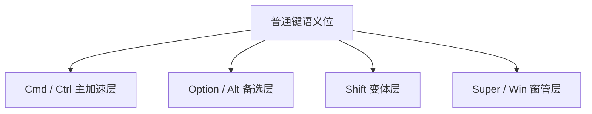
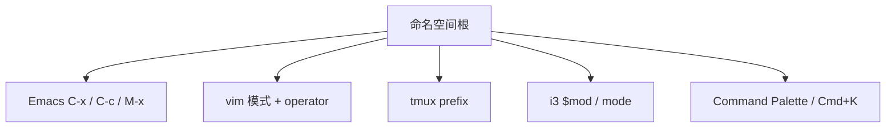

很多人第一次爱上 Cmd+K / Ctrl+K，不是因为「又多了一个功能」，而是因为：界面突然变成一张可检索的命令表。Claude、Cursor、飞书、Slack 都在抢这个键位；tmux、vim、Emacs、i3 则更早就把键盘当成命名空间来设计。本文把快捷键当成一种**系统**来看：它怎么长出来的，为什么很多应用其实在共用同一套心智模型，以及像 [KeyCombiner](https://keycombiner.com/collections/) 这类工具为什么会把「背快捷键」做成可练习的收藏。

写给重度 PC 用户：Linux / macOS / Windows 切换、tmux + vim/Emacs、i3 一类平铺窗管，都会让你发现，背键位不只是效率，它本身就很好玩。

## 一张图先立住骨架

快捷键系统大致沿着两条线演化，最后在「命令面板 / Command K」处交汇：

读图时抓住三件事：

1. **专家系统**用前缀和模态扩容（键少、语义密）。
2. **GUI 系统**用菜单字标、Ribbon KeyTips、系统级搜索降低学习成本。
3. **命令面板**把「记得名字、不记得位置」变成一等公民，并和 Slack 流行化的 Cmd+K Jump 合流。

Chris Coyier 把命令条的工作拆成三类，很适合当分析框架：Run（跑命令）、Jump（跳对象）、Search（搜内容）。见 [Command Bars](https://chriscoyier.net/2022/12/18/command-bars/)。Maggie Appleton 则把 Cmd+K 说成 GUI 里随时召唤的 CLI，见 [Command K Bars](https://maggieappleton.com/command-bar)。

## 历史：从宏与模态，到菜单与 Spotlight

### Emacs：宏长成命令语言

Emacs 的名字来自 Editing MACroS。1970 年代 MIT AI Lab 上，TECO 宏被用户实验堆出来；Richard Stallman 与 Guy Steele 等人把先前包络合并成 EMACS。关键点不在某一个「官方键表」，而在：

- **C-x** 成为文件/窗口类前缀（C-x C-s、C-x C-f 等核心绑定长期稳定）。
- **M-x（execute-extended-command）**：用名字调用命令，这是后来「搜索再执行」的直接祖先。

资料：[Computer History Museum Emacs 专题](https://softwarepreservation.computerhistory.org/emacs/)，Stallman 回忆文本 [lysator](http://www.lysator.liu.se/history/garb/txt/87-1-emacs.txt)，Digital Seams 对 M-x 与命令条关系的梳理：[Why Ctrl+Shift+P](https://digitalseams.com/blog/why-do-sublime-text-and-vs-code-use-ctrl-shift-p-for-the-command-bar)。

### vi：模态是带宽优化

Bill Joy 等在 1970 年代中后期把 em/en/ex 推到视觉模式，2BSD（1979）里 `vi` 作为 visual mode 入口定型。模态的动机很实际：慢终端上，用模式把按键带宽吃满。Joy 后来访谈里也提到，Emacs 那种无模态、可编程编辑器，当时并不在他的设计想象里。

资料：[vi 词条](https://en.wikipedia.org/wiki/Vi_(editor))，Joy 访谈存档 [joy84](https://web.archive.org/web/20120108175421/web.cecs.pdx.edu/~kirkenda/joy84.html)。

vim / Neovim 继承了这条线：Normal 里是 operator + motion 的组合语法（`dw`、`c$`），本质是一门可组合的小语言，而不只是「热键列表」。

### Xerox Star 与 Lisa/Mac：菜单上的可发现性

Xerox Star 更依赖专用功能键和属性表，不像后来 Mac 那样到处是 Command 等价键。Apple Lisa 的用户界面标准（约 1980）则明确了：菜单栏 + 下拉菜单，并用 **APPLE 键 + 字母** 激活菜单项，菜单里直接标出键帽符号。这是「加速器必须可被看见」的经典解法，也是 Mac ⌘ 字标传统的来源。

资料：[Lisa UI Standards 概述](https://guidebookgallery.org/articles/lisauserinterfacestandards)，[Star UI 概述](https://guidebookgallery.org/articles/thestaruserinterfaceanoverview)。

### Office Ribbon：发现功能，但不废除快捷键

Office 2007 用 Ribbon 替换菜单/工具栏，目标是让海量功能可被发现。但它没有取消 Ctrl+S / Ctrl+B 这类肌肉记忆；同时用 **Alt KeyTips**（字母/数字浮层）覆盖 Ribbon 控件，并保留一批旧 Alt 序列做过渡。这说明大厂也承认：发现路径和专家路径可以并存。

资料：Jensen Harris 博客 [Stroking the Keys](https://learn.microsoft.com/en-us/archive/blogs/jensenh/stroking-the-keys-in-office-12)，[Ribbon 键提示开发文档](https://learn.microsoft.com/en-us/previous-versions/office/developer/office-2007/aa338198(v=office.12))。

### Spotlight：系统级 Jump/Search

Mac OS X 10.4 Tiger（2005）带来 Spotlight，**Cmd+Space** 打开菜单式搜索，**Option+Cmd+Space** 打开完整结果窗。它的前辈包括 LaunchBar（1996，NeXTSTEP）等启动器。系统级「先搜再跳」训练了整整一代用户：你不必记得图标在哪一层文件夹。

资料：[Apple 预告 Tiger](https://www.apple.com/uk/newsroom/2004/06/28Apple-Previews-Mac-OS-X-Tiger/)，[Macworld Tiger Spotlight](https://www.macworld.com/article/175478/tigerspotlight.html)。

### 编辑器命令面板：Sublime → VS Code → Cursor

Jon Skinner 在 2011 年前后把 Command Palette 带进 Sublime Text，并提到 Mac 菜单搜索等先例。绑定落在 **Ctrl/Cmd+Shift+P**：因为 Print 不常用，Ctrl/Cmd+P 留给 Goto File，面板是它的延伸。VS Code 沿用同一套（Command Palette + Quick Open）。Cursor 作为 VS Code 系产品，仍保留 Cmd+Shift+P 面板，同时把 **Cmd+K** 用在 Inline Edit / 终端 AI 提示等「和弦领袖」位置，和「面板键」刻意分开。

资料：[Sublime Text 2 beta 日志](https://www.sublimetext.com/blog/articles/sublime-text-2-beta)，[Digital Seams 考证](https://digitalseams.com/blog/why-do-sublime-text-and-vs-code-use-ctrl-shift-p-for-the-command-bar)，[VS Code UI](https://code.visualstudio.com/docs/getstarted/userinterface)，[Cursor shortcuts](https://cursor.com/docs/reference/keyboard-shortcuts)。

注意措辞：说「Sublime 发明命令面板」过满。更准确是：它把编辑器里的可检索命令面做成主流模式，并固定了 Shift+P 键位文化。

### Cmd+K：一次几乎偶然的标准化

Word 等软件里，Ctrl+K 长期是「插入超链接」。另一条完全不同的语义线来自 Slack。

2014 年，Ben van Enckevort 在 hack day 里给 Slack 做了个 Quick Switcher 演示。常用键被占光后，他几乎随意选了 **K**（自述感觉像没人碰的 Kill 键）。Slack 随后正式做了 Quick Switcher，并保留 Cmd/Ctrl+K。因为 Slack 用户面远大于编辑器圈，**K = 应用内 Jump** 被大量创业公司产品抄走：Linear 的命令菜单、Notion / 飞书的搜索跳转，以及今天一堆 AI 产品的「万能框」。

资料：Ben 本人在 UX Stack Exchange 的回答 [How did CMD-K become standard](https://ux.stackexchange.com/questions/153299/how-did-cmd-k-come-to-be-the-standard-shortcut-for-both-adding-a-hyperlink-and-o)，[Slack Engineering 回顾](https://slack.engineering/a-faster-smarter-quick-switcher/)，[Linear 文档](https://linear.app/docs/creating-issues)，[飞书快捷键](https://www.larksuite.com/hc/en-US/articles/400301636110-use-keyboard-shortcuts-in-the-lark-desktop-app)。

所以今天你会看到冲突地图：同一物理键，在文档里是链接，在协作工具里是跳转，在 VS Code 里是和弦前缀，在 Cursor 里又可能是 AI。标准化从来不是一张无冲突的表，而是**传播路径**的结果。

## 设计词汇：你其实一直在背同一门语法

### 修饰键层

把修饰键想成「选层」：

macOS HIG 长期把 Command 当主加速键，Option 提供备选，Control 谨慎使用；菜单里展示顺序也有惯例。跨平台应用则常见 **Cmd ↔ Ctrl** 映射（复制粘贴、命令框）。窗管（i3/sway）更喜欢 **Mod4=Super**，避免和应用程序抢 Alt。

资料：[macOS 键盘符号](https://support.apple.com/guide/mac-help/what-are-those-symbols-shown-in-menus-cpmh0011/mac)，[i3 User's Guide](https://i3wm.org/docs/userguide.html)。

### 同时和弦、顺序和弦、前缀、模态

| 模式 | 例子 | 特点 |
| --- | --- | --- |
| 同时和弦 | Cmd+S | 按住修饰键 + 一键 |
| 顺序和弦 | VS Code Ctrl+K Ctrl+S；Emacs C-x C-s | 第一键占用绑定空间，等第二键 |
| 前缀模式 | tmux Ctrl-b；GNU Screen Ctrl-a；i3 $mod | 先 leader，再命令 |
| 模态状态 | vim Normal/Insert；i3 binding modes | 状态持续到退出 |

VS Code 的 chord 设计明确承认：第一半键不能再当独立命令，这是用时间换命名空间。见 Microsoft 对 chords 的说明（经 Digital Seams / 社区讨论引用）。

### 可发现性 vs 速度

Nielsen Norman Group 把快捷键定位为 **accelerator**：它是专家的并行路径，不该是唯一路径；应通过菜单字标、tooltip、即时提示、速查表露出。见 [UI Accelerators](https://www.nngroup.com/articles/ui-accelerators/)。

命令面板卡在中间：你记得「大概叫什么」，不必记得菜单路径，也不必一次背死和弦。这正是它同时讨好 GUI 用户和 CLI 用户的原因。

### 肌肉记忆迁移

跨 OS 最稳的是语义迁移（保存、复制、命令框），最脆的是修饰键物理位置（Mac Control vs Windows Ctrl，Alt vs Option，Super vs Win）。Notion 一类产品直接在文档里写 `cmd/ctrl` 双记号，等于承认用户活在双系统现实里。

## 专家生态：前缀树才是共通点

把 i3、tmux、vim、Emacs 放在一起看，会发现它们和 Cmd+K 产品其实同构：都在维护一棵**命令前缀树**。

- **tmux**：默认 prefix 是 Ctrl-b（避开 Screen 的 Ctrl-a，也避开 Emacs/readline 的 Ctrl-a 行首）。连按两次 prefix 才送出字面 Ctrl-b。见 [tmux Getting Started](https://github.com/tmux/tmux/wiki/Getting-Started)。
- **i3 / sway**：`$mod` + 字母；可用 binding modes 临时换一张键表（resize 等）。默认还常接 dmenu，那就是迷你命令面板。见 [i3 userguide](https://i3wm.org/docs/userguide.html)。
- **vim**：模式是状态机；Normal 下的语法是可组合命令语言。
- **Emacs**：Ctrl/Meta 层 + 前缀 + M-x 名字空间，极端可扩展，但核心 Ctrl/Meta 绑定几十年相对稳定。

Unix 重度用户会觉得「背快捷键好玩」，往往是因为你在学的不是零散热键，而是一门**可迁移的空间几何**：前缀在哪，层怎么切，模态何时切换。

## KeyCombiner：把快捷键当成可练习的系统

[KeyCombiner](https://keycombiner.com/)（作者 Thomas Kainrad）不是又一张 PDF 速查表。它把快捷键做成：

1. **公共库**：VS Code、Vim、IntelliJ、Gmail、Notion、Excel 等可导入。
2. **个人收藏（collections）**：像播放列表一样策展你要练的集合，见 [collections](https://keycombiner.com/collections/)。
3. **间隔重复练习**：用速度和错误估置信度。
4. **桌面速查**：按当前前台应用弹出你的集合（默认 Meta/Cmd+Alt+C 一类绑定，以官网为准）。

对这篇笔记的意义在于：它把「背键」从玄学变成可运营的技能系统。这和你喜欢 tmux/vim/i3 的感觉是同一类快感，只是对象从窗管/编辑器扩到了所有 GUI 应用。

FAQ：[keycombiner.com/faq](https://keycombiner.com/faq/)。

## 几个可画进脑子的模型

1. **Run / Jump / Search**（Coyier）：分析任何一个 Cmd+K，先问它到底在干哪一类，还是三类混装。混装越猛，排序与预期管理越难。
2. **加速器阶梯**：像素点击 → 菜单字标 → tooltip → 命令面板 → 死记和弦。NN/g + Lisa 菜单字标是两端的经典。
3. **前缀树**：C-x、tmux prefix、Ctrl+K chord、i3 $mod、命令面板输入框，都是根节点不同的同一数据结构。
4. **冲突图**：K 键同时承担链接、跳转、和弦领袖、AI 入口。标准化靠流行度，不靠无矛盾的理想表。
5. **Cmd+Space vs Cmd+K**：前者偏系统/全局上下文，后者偏应用内上下文（Appleton 文下也有类似讨论）。

实现清单可参考：[awesome-command-palette](https://github.com/stefanjudis/awesome-command-palette)。

## 对日常工作流的一点收束

如果你已经在用 tmux + vim/Emacs + i3，再去用 Cursor / Claude / 飞书的命令框，不必当成全新技能。你可以故意统一自己的「个人前缀哲学」：

- 系统级搜索用 OS 原生（Spotlight / 启动器）。
- 应用内 Jump/Run 优先找 Cmd/Ctrl+K 或 Shift+P，先看它是 Jump 还是 Run。
- 真正高密度工作仍放回模态/前缀系统（vim、tmux），GUI 面板只做发现和偶尔跨应用跳转。
- 用 KeyCombiner 一类工具把「正在练的集合」显式化，避免永远停留在复制粘贴三件套。

## 主要参考（短名单）

- Stallman Emacs 史：http://www.lysator.liu.se/history/garb/txt/87-1-emacs.txt
- Joy vi 访谈：https://web.archive.org/web/20120108175421/web.cecs.pdx.edu/~kirkenda/joy84.html
- Lisa / Star UI：guidebookgallery 上述两文
- Office KeyTips：https://learn.microsoft.com/en-us/archive/blogs/jensenh/stroking-the-keys-in-office-12
- Spotlight：Apple Newsroom Tiger 预告
- Sublime / Shift+P 考证：https://digitalseams.com/blog/why-do-sublime-text-and-vs-code-use-ctrl-shift-p-for-the-command-bar
- Cmd+K 起源（Ben）：https://ux.stackexchange.com/questions/153299/how-did-cmd-k-come-to-be-the-standard-shortcut-for-both-adding-a-hyperlink-and-o
- Appleton：https://maggieappleton.com/command-bar
- Coyier：https://chriscoyier.net/2022/12/18/command-bars/
- NN/g：https://www.nngroup.com/articles/ui-accelerators/
- i3：https://i3wm.org/docs/userguide.html
- KeyCombiner：https://keycombiner.com/
