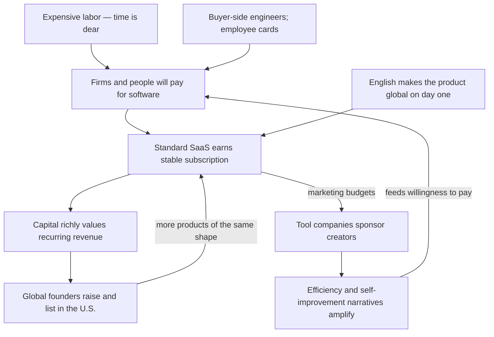

The feed says America loves productivity tools. Look closer: the heat sits in English-speaking professional and tech strata — people whose hours are expensive enough that a seat looks cheap, who can swipe a card without a procurement fight, and who fear falling out of their class if the personal system fails. X and Product Hunt make that stratum look like a people. It is a market segment with a megaphone.

In 2024 more than half of global software spend landed in the United States. The Protestant-culture story names the *accent* and misses the *machine*. Koreans work longer hours; Chinese and Korean respondents put work first at far higher rates; East Asian demand for self-improvement is loud — and still no equal export industry of productivity software grew there. What concentrates building is buyer structure and capital: expensive labor, engineers on the buyer side, employee cards, low piracy, subscription multiples, English as a day-one global surface. Class stratification and productivity-SaaS heat are the same loop, not two coincidences sharing a decade.

That market sells a particular relief. It does not heal inequality; it sells micro-control inside a fixed distribution, and sinks responsibility from structure onto personal systems. Makers turn anxiety into ARR. Audiences buy a steering wheel they can grip. Fanatics moralize tidiness into desert. Platforms reward the demo over the bargain. AI does not end the race — it changes the unit, from managing hours to commanding non-human labor.

## Three claims bundled as one

The popular explanation glues three statements together. First, production: America ships the most numerous and highest-valued SaaS and productivity tools. Second, content: English-language self-improvement and productivity media are enormous and loud. Third, causation: both follow from Protestant ethics, Taylorism, Silicon Valley culture, and individualism.

The first two are factual and checkable. The third is causal and needs a control. East Asia is ready-made: Japan, Korea, and mainland China match or exceed U.S. competitive intensity and hunger for self-improvement; Korea’s hours are longer. If culture were the main engine, those places should have grown a comparable export software industry. Two natural experiments cut the same way. Indian SaaS firms treat North America as the primary market from day one. After 2024, a wave of Chinese-founded AI apps charges overseas users directly. The founders’ cultural backgrounds have nothing to do with Puritanism; product shape and business model look like American companies anyway.

One vocabulary trap first. “America” and “the English-speaking world” get merged in this topic: many of the loudest productivity creators are British; many “American” tool founders grew up in Canada, Finland, Ukraine, or China. Where the distinction matters, this essay separates them.

## The phenomenon is real: spend, firms, and capital concentrate in the U.S.

S&P Global Market Intelligence (cited by WIPO in June 2025) puts 2024 global software spend near $675 billion, with the U.S. alone at $368.5 billion — over 54%. China is second at $61.8 billion, about one-sixth of the U.S. The U.S. is also the only economy where software spend exceeds 1% of GDP. Firm counts rhyme: Statista’s 2024 estimate (secondhand, magnitude only) has roughly 30,800 SaaS companies worldwide — about 17,000 in the U.S., 1,500 in the U.K., 992 in Canada, 711 in India. On CB Insights’ 2025 unicorn tally: U.S. 712, China 157, Korea 14, Japan 9. BVP’s Emerging Cloud Index in September 2026 lists 66 constituents and none from China, Japan, or Korea — partly an artifact of U.S. listing, but the shape is still the shape. These are all-software or all-industry slices; productivity tools are not broken out separately. Direction is unambiguous.

China compresses into a few numbers. A late-2023 China Telecom Think Tank report puts the 2021 China SaaS market at ¥44.3 billion — 6.6% of the U.S. — about a decade behind, with over 58% of large enterprises preferring in-house or custom third-party builds. iResearch’s 2023 enterprise SaaS figure is ¥88.8 billion. DingTalk is the blunt instrument: by end-2023, 700 million users and 25 million organizations, of which 120,000 paid for software — under 0.5% of organizations. Capital markets agree: Weimob’s drawdown from its 2021 peak exceeded 95%; Yonyou still lost ¥1.389 billion in 2025. Kingdee turned its first profit since 2020 in 2025, with cloud at 82.5% of revenue — subscription can work in China; it is slow and hard.

Japan is a different geometry. IPA’s 2015 international comparison: 72.0% of Japanese IT talent sits inside IT vendors (integrators, outsourcers, software houses), versus 34.6% in the U.S., 38.6% in Germany, 46.1% in France. American firms mostly select and assemble software with their own engineers; Japanese firms mostly commission SIer customization. METI’s 2018 DX report warned that un-updated legacy systems could cost up to ¥12 trillion a year after 2025.

Japanese SaaS is growing fast lately. Sansan, freee, and Money Forward posted 24–31% annual revenue growth across 2025–2026 disclosures; SmartHR announced ¥30 billion ARR in July 2026; in 2020 the government struck 14,909 of 14,992 seal-required administrative rules. Growth is real. The historical buyer structure still explains why standardization arrived late.

So claim one holds, thoroughly. The puzzle is not “America builds a bit more.” It is why concentration reaches this degree.

## Culture explains only half

### Protestant ethics: evidence splits

Weber’s thesis has been stress-tested in economics; the results do not line up neatly. Becker and Woessmann (2009), using 19th-century Prussian counties and distance to Wittenberg as an instrument, find Protestant regions richer — but the gap runs mainly through literacy and education, not work ethic as such. Cantoni (2015), on city populations from 1300–1900, finds no Protestant growth effect. Counter-evidence exists too: Spenkuch, instrumenting with the 1555 Peace of Augsburg, finds contemporary German Protestants still work longer hours and earn more total income without higher hourly wages — a values channel, he argues, not institutions or schooling; van Hoorn and Maseland, across 82 societies and 150,000 people, find unemployment hits Protestant well-being harder.

Taken together: Protestant values measurably affect how long people will work and how badly unemployment hurts. They explain growth and industry form much more weakly. American productivity culture does carry Puritan residue. Franklin’s autobiography records thirteen virtues, one per week, in a 7×13 fault grid; his day begins at 5 a.m. with “What good shall I do this day?” — habit tracker plus time block avant la lettre. “Time is money” appears in his 1748 *Advice to a Young Tradesman*, though the phrase already showed up in a 1719 London periodical.

### If diligence were the cause, East Asia should build more

OECD 2025: Korea averages 1,833 hours per employed person per year, the U.S. 1,800, Japan 1,598, Germany 1,332 (relative ranks only, per OECD caveats). Americans work long hours; they are not the longest. Koreans work longer still and earn roughly 30% less annually — diligence and labor price are separate. Japanese overwork has not vanished: MHLW’s FY2024 figures show 1,055 recognized mental-health work-injury cases, first time past 1,000, a sixth consecutive record. China had 996.ICU in 2019; the Supreme People’s Court called 996 illegal in 2021. Korea cut the weekly cap from 68 to 52 hours in 2018; a 2023 proposal to loosen toward 69 hours was withdrawn under youth and union pressure.

Values surveys make the folk story look stranger still.

World Values Survey Wave 7 (King’s College London Policy Institute, 2023): agreement that “work should always come first” is 82% in China, 47% in Korea, 29% in Germany, 28% in the U.S., 10% in Japan. “Work is a duty toward society”: China 83%, U.S. 59%, Japan 58%.

Individualism indices no longer prop up the popular line either. Hofstede’s older scores had the U.S. at 91, Japan 46, Korea 18, China 20 — often cited as proof Americans are uniquely individualist. After The Culture Factor’s 2023 Minkov–Kaasa update: U.S. 60, Japan 62, Korea 58, China 43, Netherlands 100, Germany 79, U.K. 76 — with an official note that the old U.S. score may have been high. Change the meter and America falls from runaway lead to near Japan and Korea. Indexes like these are fragile grounds for industry geography.

### East Asian demand for self-improvement is not weak

China’s knowledge-pay boom after 2016: Dedao reported 45.4 million activations by mid-2021; Fan Deng Reading passed 60 million members by Q3 2022. Japan’s *The Courage to Be Disliked* sold 13.5 million copies worldwide and topped Korea’s 2015 bestseller list; Hobonichi’s 2026 planner edition cleared one million units by end of January 2026, over half overseas. Korea popularized “miracle morning” and “god-life” self-discipline from 2020, with study vlogs and “study with me” streams.

Notion’s localization choices are the cleanest tell. Its first non-English ship, August 2020, was Korean: official blogs noted Korean users had already written four tutorial books, run workshops, and made videos before localization — Korean press said Korea was then Notion’s largest market outside the U.S. When the Japanese beta landed in October 2021, Notion called Japan a major market with 4× daily actives in a year, while over 80% of users already sat outside the U.S. Earlier still: after the failed v1 in 2015, Ivan Zhao and co-founders rewrote Notion in Kyoto for a craft culture. By April 2026 Notion ranked Korea in its global top five for Notion AI adoption. East Asians *use* productivity tools eagerly. Most of those tools are not East Asian companies.

### What culture does explain

Culture does not place the software industry. It shapes American productivity culture’s accent. The right half of the values chart is a real difference: agreement that “in the long run, hard work usually brings a better life” is 55% in the U.S., 29% in Japan, 28% in Germany, 16% in Korea. Self-improvement content sells that premise: personal method, habit, and tool can change personal outcome.

A working guess: in societies where fewer people believe individual effort moves outcomes, self-improvement appears in other forms — exam tracks and promotion ladders inside organizations, or paper planners that promise order without promising results. Chinese agreement that effort pays (58%) sits near the U.S., which matches China’s knowledge-pay and success-literature boom; the difference is that demand became content platforms and courses, not export software companies. Culture explains tone. It does not explain why building and selling concentrate in America.

## Method nationality is not product nationality

Ask who invented the methods and America’s center thins.

The Pomodoro Technique is Francesco Cirillo’s, late-1980s Italy, spread first as a free PDF past two million downloads before Currency (Penguin Random House) issued a formal English book in 2018. Zettelkasten is Niklas Luhmann’s, ~90,000 cards from 1951–1996, and rode Roam Research and Obsidian into English internet fashion around 2020. Kanban is Toyota’s — Taiichi Ohno built it from late-1940s–1960s supermarket restocking ideas; “lean” is John Krafcik’s 1988 *Sloan Management Review* coinage, globalized by MIT’s 1990 *The Machine That Changed the World*, then democratized by Trello in 2011.

Kaizen’s path is more tangled. Its postwar Japanese promotion began with U.S. Training Within Industry (TWI); a 1951 training film carried it into factories; Japanese firms turned it into continuous-improvement culture; Masaaki Imai’s 1986 English *Kaizen* (McGraw-Hill) made the word global management vocabulary. Taylorism runs the other way: published in the U.S. in 1911, introduced to Japan by Ueno Yōichi in 1912, Japanese translation 1913, and Lenin’s 1918 *Immediate Tasks of the Soviet Government* calling for study and adoption of the Taylor system.

America invented plenty of its own — Franklin’s virtue grid, Eisenhower’s 1954 urgent/important distinction, Grove’s 1970s OKR precursor at Intel, David Allen’s 2001 GTD. America’s sharper comparative advantage is the back half of the pipeline: turn a method into book, course, consulting, and software, then sell it worldwide. Covey packaged urgent/important as quadrants in 1989; *The 7 Habits* had sold over 20 million by 2012. John Doerr brought OKRs into Google in 1999 and wrote *Measure What Matters* in 2018. *Atomic Habits* claims over 30 million copies in 60+ languages on the author’s site.

The division of labor is clear: methods can be born anywhere; scaling the method into a business concentrates in the English market — the same shape as software industry geography in section two.

Tools follow the same map. Many products treated as “American productivity tools” were not founded by people raised in America. Notion’s Ivan Zhao was born in Ürümqi and moved to Vancouver in high school; Zoom’s Eric Yuan is from Tai’an, Shandong, and reached Silicon Valley in 1997; Slack’s precursor Tiny Speck started in Vancouver in 2009 under Canadian Stewart Butterfield; Grammarly was founded in Kyiv in 2009 by three Ukrainians; Miro began in Perm in 2011, later headquartered in Amsterdam and San Francisco, closing Perm in 2022; Linear’s three founders are Finnish, CEO Karri Saarinen moving to San Francisco via Y Combinator in 2012; Todoist’s Amir Salihefendic was born in Bosnia and raised in Denmark; Obsidian’s authors came out of Waterloo. Atlassian and Canva stay headquartered in Sydney, yet Atlassian took ~42% of FY2025 revenue from the U.S.; Zoom’s FY2025 APAC plus EMEA share was only 28.2% combined.

Chinese-founded productivity tools make the pattern sharper. XMind launched in Shenzhen in 2006; founder Sun Fang later said paid software had more soil overseas — the first decade was mostly foreign revenue, domestic/overseas roughly even only around 2020. TickTick’s overseas entity runs from Hong Kong; AFFiNE is registered in Singapore; early Logseq users skewed English overseas. HeyGen started in Shenzhen in 2020 and moved HQ to Los Angeles in 2022; Genspark was founded in Palo Alto in 2023 by former Baidu executives aiming at the U.S. Yuan has said a Gates keynote at a trade show sent him to Silicon Valley — “maybe I should go see.” People follow markets and capital; tool “nationality” lands in America.

## The real engine: who pays, how much, and how capital prices the check

Set culture aside. The remaining variables point the same way: the U.S. is the largest market most willing to pay for software, in the payment shape that fits standardized products.

### Labor is expensive, so software looks cheap

OECD 2025 average full-time annual wages (PPP): U.S. $86,977, Korea $61,259, Japan $50,183. China’s NBS 2025 urban non-private average is ¥129,441; private ¥71,590. Japan Productivity Center 2024: U.S. GDP per hour (PPP) $116.5, OECD average $79.4, Japan $60.1, Korea $57.5. An American hour is among the world’s dearest. A few-dozen-dollar monthly seat that saves a few hours barely needs a spreadsheet in the U.S.; where labor is cheap, the default is often another hire. Chen Guo’s 2024 contrast: an ERP implementation around ¥5 million in China versus ~$30 million for a similar North American project. Compress price that far and standardized product R&D struggles to pay for itself.

Expensive labor is necessary, not sufficient. German average wages are $76,285 with among the shortest OECD hours — every incentive to buy software instead of people — yet Germany did not grow a U.S.-scale SaaS industry. Europe has SAP and many tool companies; what it lacks, on this reading, is a single-language mass market and a capital market that richly values loss-making subscription companies. Britain is another control: English-speaking, expensive labor, ~1,500 SaaS firms on Statista’s estimate — under half the U.S. per capita. Language and wages alone are not enough; domestic market scale and capital depth matter.

### Buyer structure: engineers on the buyer side, cards in employees’ pockets

How software is bought decides what software can sell. Roughly two-thirds of U.S. IT talent sits inside user enterprises — people who can evaluate, trial, and wire a standard SaaS without a vendor team on-site. A five-person group can sign up for Notion or Linear today and expense it tomorrow; product-led growth works because that buyer structure exists.

China and Japan invert it. Telecom Think Tank: over 58% of large Chinese enterprises prefer build or custom; Japan: 72% of IT talent on the vendor side. Purchases often clear through a boss or IT department that wants “change it to our process” — standardized product loses. Payment habits diverge too. BSA’s 2018 Global Software Survey (some country figures secondhand): unauthorized PC software in 2017 was ~15% in the U.S., 16% Japan, 66% China, 56% India, 37% global average. Platform free strategies amplify the gap: DingTalk, WeCom, and Feishu folded collaboration into giant ecosystems — WeCom claimed over 14 million organizations served in 2025; DingTalk’s 25 million organizations include only 120,000 paying. Independent tools compete poorly against a free suite.

### Capital prices subscription

U.S. public markets long paid high multiples for high-gross-margin, high-retention recurring revenue; only in early 2026 did forward software P/E first trade flat with the S&P 500. A company can lose money for years if net revenue retention looks good. That gives founders reason to build standardized productivity tools and VCs reason to fund several bets in one niche. BVP’s Emerging Cloud Index has no China/Japan/Korea names; Weimob’s Hong Kong drawdown from the 2021 peak exceeded 95% (company-specific damage too: 2024 revenue −39.9%, loss ¥1.744 billion). Both point, at least partly, the same way: where capital will mark the valuation, founders are more likely to build the product.

### English is the default market

The strongest exhibits are the two natural experiments named up front. Bain’s 2022 India SaaS report: industry ARR ~$12–13 billion, only ~20% from India itself. Freshworks FY2025: $838.8 million revenue, 46.6% North America. Zoho FY2025: North America 41%, Asia 30%. Indian founders need no Protestant ethic; English saleability into North America is enough to produce American-shaped SaaS.

Chinese AI teams in this cycle walked the same road. HeyGen — Chinese founders, Shenzhen start, later Los Angeles HQ — hit $200 million ARR by June 2026. The same teams struggle to charge against free super-apps at home and can mint nine-figure ARR abroad. A handful of cases cannot isolate one variable; the sharpest difference is the buyer.

Chain the pieces and the loop reinforces itself:

## The content flywheel: why English self-improvement hosts run hot

As of September 2026 the English self-improvement YouTube tier runs from multi-million to near-twenty-million subscribers — Bartlett, Huberman, Abdaal, Robbins, Hormozi, and peers. Several of the loudest hosts are British or otherwise non-U.S.; the accurate unit is the English-speaking world, not America alone.

Put East Asia on the same page and the picture is not one-sided.

Japan’s personal-finance / self-improvement channel “両学長 リベラルアーツ大学” has 9.76M subscribers — more than Ali Abdaal; comedian Atsuhiko Nakata’s knowledge channel has 5.48M. Korea’s money-and-self-improvement “신사임당” has 2.82M; “김작가 TV” ~2.73M. Japan’s population is ~120 million, Korea’s ~51 million; English hosts face a global English audience. Per potential viewer, East Asian head channels punch harder. China’s analogue sits on Bilibili: Chen Rui said in 2021 that general-knowledge content was 45% of Bilibili playback; a 2023 industry report counted 243 million users watching knowledge content in the prior year; criminal-law lecturer Luo Xiang had 32.08 million fans by early 2026. East Asian audiences buy “make yourself better” content. Market-size estimates agree: Grand View Research puts the 2025 global personal-development market near $51 billion, North America only 34.8% — while the U.S. alone takes over half of global software spend. Demand for self-improvement is spread far more evenly than the software industry.

The gap is money, and how far content can travel.

Google does not publish country RPMs; third-party estimates often differ by 2× — magnitude only. Lenos (April 2026): creator RPM ~$10.81 for a U.S. audience, $7.12 U.K., $2.90 Japan, $0.46 India, $0.15 Philippines. Business Insider checked Ali Abdaal’s backend: 2022 average RPM $8.23. Same content, English audience: several times Japan’s value per view, tens of times Southeast Asia’s. That decides who can fund teams, editing, and research — and how many people the category can attract.

A second money pipe is the tool companies themselves. Notion’s affiliate program pays up to $50 per activated signup plus 20% of first-year revenue, plus creator Builders programs and a template marketplace. Influencer Marketing Hub / NeoReach’s 2025 survey of 3,000+ creators: over 49% said brand deals were their main income. Ali Abdaal’s public 2022 breakdown (third-party tallies, indicative): ~$4.6M — and the largest slice was not ads or sponsorships but a course teaching others to become productivity creators. The business closes a loop: efficiency content draws the audience, affiliates monetize, then “how to join the religion” becomes the product that pays most. The “tool companies sponsor creators” node in section five’s loop is that business.

Belief remains a last variable. Section three: 55% of U.S. respondents believe effort usually brings a better life; 16% in Korea. Self-improvement sells a causal promise — change the habit, system, or tool, and outcomes move. More believers means more people treat the genre as “investing in yourself” rather than chicken soup. Daytime Japanese and Korean head-channel scale still shows belief differences shape tone and topic more than raw demand. What lets English self-improvement dominate other languages is higher ad RPMs, tool-company sponsorship budgets, and a global audience pool.

## The reverse: tool prosperity did not cash out as macro productivity

An awkward backdrop: the industry’s boom years were among America’s slowest productivity-growth years.

BLS nonfarm business labor productivity by cycle: 2.7% a year 1947–1973, 2.8% 2001–2007; only 1.5% from end-2007 to end-2019 — second-slowest postwar stretch. Those twelve years cover iPhone ubiquity and the mass arrival of Slack, Notion, Asana-class collaboration tools. The cycle since end-2019 recovered to 2.1%, with 3.0% for full-year 2024 — and Kansas City Fed analysis doubts attributing that lift to AI (see section eight). The series does not prove tools slowed productivity; the financial crisis and weak investment sit in the same window. What it does show: tool prosperity did not cash out as macro efficiency. Solow’s July 1987 *New York Times Book Review* line — the computer age everywhere except the productivity statistics — travels cleanly onto SaaS.

Micro data explains part of it. An August 2022 *Harvard Business Review* study of 20 teams / 137 employees across three Fortune 500 firms over 3,200 workdays: ~1,200 app/site switches per day, over two seconds to re-enter focus each time — nearly four hours a week, ~9% of work time. Asana’s 2023 Anatomy of Work survey (9,615 knowledge workers, six countries): 58% of time on “work about work” — finding information, chasing status, toggling tools — versus 33% skilled work and 9% strategic. Tool counts still rise: Okta customers averaged 101 apps in 2024, first time past 100; Zylo’s 2025 purchased-license average was 305 SaaS apps per organization (different methods — do not equate). Each tool saves locally; together they invent coordination cost.

Critique has always existed, mostly from inside the English-speaking world. Merlin Mann early coined “productivity porn” for consuming efficiency tips as a substitute for efficiency; Tim Kreider’s 2012 *New York Times* “Busy Trap” called much white-collar busyness self-branding; Derek Thompson’s 2019 *Atlantic* “workism” named elite America’s work fervor; Cal Newport’s 2021 *New Yorker* piece argued knowledge workers were done with “personal productivity” and that the problem belongs at organization and system level. Anne Helen Petersen’s 2019 millennial-burnout essay and Oliver Burkeman’s 2021 *Four Thousand Weeks* sit in the same current. “Quiet quitting” went viral on TikTok in 2022; Gallup that year estimated at least half of U.S. employees were quiet quitters doing only the job description.

East Asia has its own versions. China’s 2021 “lie flat” wave, later cooled by regulators; Japan’s 2013 buzzword candidate *satori sedai* for youth cool to consumption and ambition; Korea’s path from the 2011 “three-give-up generation” to “N-give-up.” Direction rhymes with American anti-efficiency currents; starting points differ. U.S. critique targets the promise that the individual should endlessly optimize the self; East Asian versions more often answer “effort still doesn’t pay.” Low Japanese and Korean agreement that effort pays matches that reading; Chinese respondents in the 2018 wave still agreed effort pays at high rates, and lie-flat only surged in 2021 — more a reading of changed circumstances than a permanent values gap.

## A symptom market

The heat is real — and narrower than the feed suggests. What looks like “America loves Todoist” is mostly English-speaking professional and tech strata performing optimization in public. X and Product Hunt amplify people who can demo a setup, not people bargaining for shorter hours. Much of the country clocks in and buys groceries; it does not fund Linear’s ARR.

Class stratification and productivity-SaaS heat are the same machine. Expensive labor makes seats cheap relative to heads. Card-swipe buyers turn anxiety into MRR without a procurement committee. Individualized failure fear — miss the promotion, lose the role, fall out of the stratum — makes “fix your system” feel like survival. Capital prices the resulting ARR. English makes the product global on day one. Culture supplies the sermon; the machine supplies the invoice.

Productivity culture is a *symptom market*. It does not heal inequality. It sells micro-control inside a fixed distribution: better calendar, cleaner inbox, tighter Notion dashboard — while the wage ladder, ownership of the firm, and who can absorb a bad quarter stay where they were. Responsibility sinks from structure to personal systems. When output stalls, the prescribed move is a new habit tracker, not a harder look at staffing, incentives, or power.

Three gears keep it spinning. **Makers** are often people who already optimized themselves hard enough to productize the anxiety — private panic turned into an ARR narrative. **Audiences** buy a controllable steering wheel: if the week went badly, at least the system was yours. **Fanatics** supply the moral aesthetics — tidy people deserve outcomes — and keep the religion funded with tutorials, setups, and affiliate links. Platforms pay for what can be demonstrated. A screen recording of a second brain travels; invisible collective bargaining does not.

AI tightens the same race. The object of optimization migrates from managing the self to commanding non-human labor. Anxiety does not shrink; it changes units — from hours rescued to agents deployed.

## The AI era: where the center of gravity moves

### From tool to labor

In December 2024, Microsoft CEO Satya Nadella told the BG2 podcast (third-party transcript) that business apps are essentially CRUD databases with business logic, that logic will move into the AI layer, and business apps may collapse in an agent era. Foundation Capital argued the same year for “service as software”: AI is not chasing a ~$200 billion SaaS market but $2.3 trillion of wages plus $2.3 trillion of outsourced services. Both point one way: productivity tools used to sell interfaces that make people faster; next they sell work that gets finished.

Public markets priced that judgment in early 2026. Late January, Anthropic shipped Claude Cowork plugins for legal, finance, and data; on February 3 Thomson Reuters fell as much as 18% intraday, RELX 14%, Wolters Kluwer 13% — Bloomberg framed the slide as weak earnings plus stronger models plus the plugins. Software ETF IGV fell 36.6% from its high to the April 10, 2026 low; software’s long valuation premium briefly vanished. IGV then rebounded nearly 46%; Atlassian, down 66.5% from its high, later rose 194%. Repricing, not disappearance.

Billing changes are more concrete. Intercom’s AI support agent Fin charges $0.99 per successful resolution against human-seat prices of $29–132/month; the company later rebranded as Fin and signed a ~$3.6 billion Salesforce deal in June 2026. Salesforce’s own Agentforce ran three pricing modes in two years: $2 per conversation, $0.10-per-action credits, plus per-head licenses. AI-native growth curves sit off the seat-SaaS scale: Lovable went $100M to $400M ARR in seven months with 146 employees; Cursor hit $2B annualized revenue by February 2026.

### Efficiency evidence lags the efficiency story

METR’s July 2025 RCT: 16 experienced open-source developers, 246 real tasks — AI tools *lengthened* completion time 19%; developers expected a 24% speedup beforehand and still felt 20% faster afterward. METR’s February 2026 update flipped the point estimate toward speedup (veteran participants 18% faster, CI crossing zero) while finding 30–50% of developers avoid tasks they would not do without AI — the team itself called the signal unreliable.

Other evidence disagrees with itself too. Brynjolfsson et al. on 5,179 customer-support agents: +14% issues resolved per hour on average, +34% for novices, near zero for veterans. MIT NANDA 2025: enterprises spent $30–40 billion on generative AI; 95% saw no measurable business return. Macro: U.S. Q2 2026 labor productivity +1.4% annualized; labor share of income 52.9%, lowest since 1947; Kansas City Fed analysis finds little explanatory power for AI adoption in the aggregate lift.

Same old productivity-tool problem: the feeling of “I got faster” arrives sooner, and more optimistically, than the productivity statistics.

### Build and use split apart

Microsoft AI Economy Institute’s public data, 2026 Q1: share of working-age population that has used generative AI — UAE 70.1%, Singapore 63.4%, Korea 37.1%, Taiwan 31.8%, U.S. 31.3% (21st of 147 economies with data, ranked from the public set); Japan 22.5%, mainland China 16.4%. The metric is inferred from Microsoft anonymous telemetry, then adjusted for OS/device share, internet penetration, and population — likely understating mainland China where domestic apps dominate. Anthropic’s September 2025 per-capita usage index rhymes: Israel 7.0, Singapore 4.57, Korea 3.73, U.S. 3.62, Japan 1.86. Korean willingness to pay stands out: OpenAI said in 2025 that Korea’s ChatGPT paid-user count ranked second only to the U.S.

Mainland China takes another road. QuestMobile: May 2026 AI-native app MAU 499 million — Doubao 382M, Qwen 167M, DeepSeek 130M — mostly free. The State Council’s August 2025 “AI+” action opinion targets over 70% smart-terminal and agent penetration by 2027, over 90% by 2030. Meanwhile Chinese-built AI apps monetize abroad: a16z’s August 2025 list had 22 of the global top-50 mobile generative-AI apps developed by Chinese teams, only three primarily used in China; MiniMax took 60.8% of H1 2026 revenue from overseas. The path now carries political cost. Manus moved HQ to Singapore in 2025, was acquired by Meta for ~$2 billion late that year, and China’s NDRC halted the deal in April 2026.

Japan’s driver is missing people. A February 2026 survey: 78.6% of managers reported understaffing; Teikoku Databank’s March 2026 survey of 10,000+ firms found generative-AI use past 30% for the first time, at 34.6%. SoftBank’s Masayoshi Son said in July 2025 the group would deploy a billion agents — ~1,000 per employee, ~¥40/month each. For Japan, AI looks more like labor substitution than personal-efficiency upgrade.

### The self-improvement story changes object

Self-improvement content is turning too. Sam Altman said in 2023 he and CEO friends had a bet on when the first one-person billion-dollar company appears; Lovable’s 146 people at $400M ARR makes the line feel less distant. The race tightens from managing the self to commanding non-human labor: “how do I get more efficient” becomes “how many agents can I run.” The other face is anxiety: Pew 2025 found 52% of U.S. workers worried about AI’s effect on their jobs; an August 2026 Pew survey found 71% of Americans expect AI to reduce jobs.

Optimization also migrates onto the body. Bryan Johnson’s Blueprint raised $60 million in October 2025 toward an AI health assistant. Cognitive outsourcing’s cost entered the discourse: an MIT Media Lab 2025 preprint found the weakest brain connectivity in the LLM-writing group. Small sample, not peer-reviewed — but the question is direct: if thinking itself is outsourced, what is self-improvement supposed to improve?

## Where this goes

Judgments below, ordered by how firmly I hold them.

First, the grammatical subject of productivity tools shifts from person to agent. The last decade’s tools helped a knowledge worker manage tasks, documents, calendars, and attention, billed per head. Once agents execute, value is measured by work finished. Seat pricing will not vanish overnight — Salesforce already runs three modes — but valuation logic has already moved; H1 2026’s software selloff was partly the market recomputing that. Products that are mostly “forms and workflows for humans” take the hardest hit; data, permissions, and distribution — layers agents still cannot bypass — rise in value.

Second, America’s edge migrates from the application layer toward both ends: models and compute below, the paying market itself above. The application layer becomes a field where global founders fight for U.S. paying users; Chinese, Indian, and European teams are not disadvantaged there, and open models lower the bar — OpenRouter and a16z stats show Chinese open models rising from ~1% to a weekly average 13% token share through 2025. Manus’s blocked acquisition shows the geopolitical cost of “domestic team, overseas company, sell to America” is rising; more teams will pick a side earlier.

Third, East Asia will overtake on *use*, without copying America’s monetization. Korea, Singapore, and Taiwan already out-adopt the U.S.; Japan’s adoption is rising fast on a hard labor shortage — Son’s “thousand agents per employee” is demography talking. Mainland China likely reprises the SaaS-era pattern: Doubao and Qwen-class super-apps give capability away free; money settles in cloud, devices, and platforms rather than independent tool subscriptions. For Chinese indie developers, the realistic paying market remains overseas.

Fourth, self-improvement content pivots from “how to be more efficient” toward “what is worth doing” and “how not to be replaced.” Once execution is cheap, scarcity sits in judgment, taste, asking the right question, and body and attention that AI cannot substitute. Efficiency worship will not die; its object swaps from one’s own hours to agent output, and the tempo only rises. English-world hosts will still take the largest flow, but editing, translation, and dubbing barriers are being erased by AI — East Asian creators will enter English markets more easily than before.

The largest uncertainty is the evidence itself. METR moved from “19% slower” to “maybe accelerating” inside six months; any AI-efficiency conclusion expires fast. If macro productivity still shows no AI years from now, that is Solow’s paradox again. If it does show, distribution questions from a falling labor share may reach the center of public argument before “efficiency” itself does.

## Conclusion

Productivity-SaaS heat is not national character. It is a class machine priced in English ARR — expensive labor, card-swipe buyers, failure fear, and capital that loves recurring revenue.

The culture sells micro-control and sinks responsibility onto the self. That is a symptom market, not a cure for inequality.

Makers, audiences, and fanatics keep the religion spinning; platforms pay for demos, not for bargaining.

AI does not end the race. It changes the unit — from managing your hours to commanding non-human labor — while America remains the fattest paying market and “American productivity culture” keeps traveling as a commercial dialect.

## Sources

### Industry and markets

- S&P Global Market Intelligence via WIPO Global Innovation Index blog, 2025-06-02: https://www.wipo.int/en/web/global-innovation-index/w/blogs/2025/global-software-spending
- Statista SaaS company counts via Ascendix: https://ascendixtech.com/number-saas-companies-statistics/
- CB Insights unicorns via World Population Review: https://worldpopulationreview.com/country-rankings/unicorns-by-country
- BVP Nasdaq Emerging Cloud Index constituents: https://cloudindex.bvp.com/companies
- China Telecom Think Tank, China SaaS industry study, 2023-12-01: https://www.secrss.com/articles/61285
- iResearch China enterprise SaaS market size, The Paper 2024-05-08: https://m.thepaper.cn/newsDetail_forward_27296049
- Chen Guo on IT services price war and ERP implementation cost, Niutoushe 2024-07-24: https://www.niutoushe.com/92278
- DingTalk 2023 users, orgs, and paying enterprises, Beijing News 2024-01-09: https://m.bjnews.com.cn/detail/1704788856169873.html
- WeCom 2025 organizations served, Sina Finance 2025-08-20: http://finance.sina.com.cn/jjxw/2025-08-20/doc-infmrakf1823652.shtml
- Weimob price and results, Sina Finance 2025-01-13: https://finance.sina.com.cn/stock/relnews/hk/2025-01-13/doc-ineeutxc2306526.shtml
- Kingdee 2025 results: https://m.kingdee.com/resources/articles/1483562803536758273
- Yonyou 2025 results, Sina Finance 2026-04-17: https://finance.sina.com.cn/stock/relnews/cn/2026-04-17/doc-inhuvkwy3128779.shtml
- Japan MIC *White Paper on Information and Communications*, Reiwa 1, Fig. 2-3-1-6 (IPA 2015 data): https://www.soumu.go.jp/johotsusintokei/whitepaper/ja/r01/html/nd123120.html
- METI DX report “2025 cliff,” Nikkei xTECH 2018-09-07: https://xtech.nikkei.com/atcl/nxt/news/18/02581/
- SmartHR ¥30B ARR, 2026-07-07: https://smarthr.jp/release/20260707/
- Japan seal-requirement abolition, ITmedia 2020-11-13: https://www.itmedia.co.jp/news/articles/2011/13/news136.html
- Bain, India SaaS Report 2022: https://www.bain.com/insights/india-saas-report-2022/
- Freshworks FY2025 regional revenue (SEC 10-K): https://www.sec.gov/Archives/edgar/data/1544522/000154452226000036/R72.htm
- Zoho FY25 finances, Entrackr 2026-04-08: https://entrackr.com/fintrackr/zoho-reports-rs-12313-cr-revenue-and-rs-3191-cr-profit-in-fy25-11701761
- NBS, 2025 urban unit average wages, 2026-05-15: https://www.stats.gov.cn/sj/zxfbhjd/202605/t20260515_1963707.html
- OECD Data Explorer: Average annual wages; Hours worked
- Japan Productivity Center, *International Comparison of Labor Productivity 2025*: https://www.jpc-net.jp/research/assets/pdf/summary2025.pdf
- BSA, 2018 Global Software Survey: https://www.bsa.org/reports/2018-bsa-global-software-survey

### Culture and history

- Becker, Woessmann (2009). Was Weber Wrong? QJE 124(2): https://wrap.warwick.ac.uk/id/eprint/42282/
- Cantoni (2015). The Economic Effects of the Protestant Reformation. JEEA 13(4): https://ideas.repec.org/p/lmu/muenec/14811.html
- Spenkuch (2017). Religion and Work. JEBO 135: https://mpra.ub.uni-muenchen.de/29739/
- van Hoorn, Maseland (2013). Does a Protestant work ethic exist? JEBO 91: https://research.rug.nl/en/publications/does-a-protestant-work-ethic-exist-evidence-from-the-well-being-e/
- Benjamin Franklin, Autobiography (virtues and schedule): http://ushistory.org/historic-personages/franklin/autobiography/page38.htm
- Quote Investigator, Time is money: https://quoteinvestigator.com/2010/05/14/time-is-money/
- King’s College London Policy Institute, What the world thinks about work, 2023-09-07: https://www.kcl.ac.uk/policy-institute/assets/what-the-world-thinks-about-work.pdf
- The Culture Factor, Country comparison tool (2023 update): https://www.theculturefactor.com/country-comparison-tool
- Japan FY2024 overwork injury recognition, PSRN 2025-06-25: https://www.psrn.jp/topics/detail.php?id=37029
- 996.ICU: https://github.com/996icu/996.ICU
- Korea 52-hour workweek: https://www.korea.kr/special/policyCurationView.do?newsId=148855270
- Korea 69-hour proposal withdrawal, HR Brew 2023-03-27: https://www.hr-brew.com/stories/2023/03/27/world-of-hr-south-korean-government-abandons-69-hour-workweek-plan
- Dedao IPO data, Sina Tech 2022-01-24: https://finance.sina.com.cn/tech/2022-01-24/doc-ikyakumy2229896.shtml
- Fan Deng Reading membership, Woshipm: https://www.woshipm.com/pd/5664011.html
- *The Courage to Be Disliked* sales: https://ja.wikipedia.org/wiki/嫌われる勇気
- Hobonichi 2026 planner past one million, FASHIONSNAP 2026-02-18: https://www.fashionsnap.com/article/2026-02-18/2026-hobonichi-1million/
- Miracle morning in Korea, Kyunghyang 2021-01-18: https://www.khan.co.kr/article/202101180600015
- Notion Korean launch, The Investor 2020: https://www.theinvestor.co.kr/article/2391865
- Notion Japanese beta, 2021-10-12: https://finance.yahoo.com/news/notion-expands-international-reach-launching-220000075.html
- Notion AI adoption in Korea, Asia Economy 2026-04-21: https://www.asiae.co.kr/en/article/2026042116305123495

### Method origins

- Lean Enterprise Institute, Kaizen and TWI: https://www.lean.org/downloads/105.pdf
- Lean manufacturing (Krafcik 1988, MIT 1990): https://en.wikipedia.org/wiki/Lean_manufacturing
- Bielefeld University, Niklas Luhmann Archive: https://www.uni-bielefeld.de/fakultaeten/soziologie/forschung/luhmann-archiv/
- Quote Investigator, Eisenhower urgent/important: https://quoteinvestigator.com/2014/05/09/urgent/
- Objectives and key results (Grove, Doerr): https://en.wikipedia.org/wiki/Objectives_and_key_results
- Francesco Cirillo and Pomodoro: https://www.pomodorotechnique.com/francesco-cirillo/
- *The Pomodoro Technique*, Currency 2018-08-14: https://www.penguinrandomhouse.com/books/555557/the-pomodoro-technique-by-francesco-cirillo/
- Tsutsui (2001). The Way of Efficiency. Modern Asian Studies 35(2): https://www.cambridge.org/core/journals/modern-asian-studies/article/way-of-efficiency-ueno-yoichi-and-scientific-management-in-twentiethcentury-japan/43B40EA4DE9BA1C2FA907753C18A88DA
- Lenin (1918). The Immediate Tasks of the Soviet Government: https://www.marxists.org/archive/lenin/works/1918/mar/x03.htm

### Tools and founders

- Sequoia, Notion founder interview: https://sequoiacap.com/article/notion-spotlight/
- Notion Korean release 2020-08-10: https://www.notion.com/releases/2020-08-10 ; Japanese beta blog 2021-10-13: https://www.notion.com/blog/notion-launching-in-japanese
- Sequoia, Eric Yuan interview: https://sequoiacap.com/article/eric-yuan-zoom-spotlight/ ; Zoom FY2025 10-K: https://www.sec.gov/Archives/edgar/data/1585521/000158552125000042/zm-20250131.htm
- Slack Technologies: https://en.wikipedia.org/wiki/Slack_Technologies
- CNBC, Grammarly origin, 2025-01-28: https://www.cnbc.com/2025/01/28/how-grammarly-went-from-nearly-broke-to-multibillion-dollar-ai-company.html
- Miro about: https://miro.com/about/ ; Business Insider, Miro closes Perm, 2022: https://www.businessinsider.com/miro-cuts-ties-russia-closes-office-in-perm-2022-4
- First Round Review, Inside Linear: https://review.firstround.com/podcast/inside-linear-why-craft-and-focus-still-win-in-product-building/
- Atlassian FY2025 10-K: https://www.sec.gov/Archives/edgar/data/1650372/000165037225000036/team-20250630.htm
- Future Startup, Amir Salihefendic interview, 2023-02-14: https://futurestartup.com/2023/02/14/amir-salihefendic-doist/
- Obsidian about and v0.0.1 (2020-03-30): https://obsidian.md/about ; https://obsidian.md/changelog/2020-03-30-desktop-v0.0.1/
- Joel Spolsky, Announcing Trello, 2011-09-13: https://www.joelonsoftware.com/2011/09/13/announcing-trello/
- 21st Century Business Herald, XMind overseas path, 2024-08-19: https://www.21jingji.com/article/20240819/herald/94dd2cc4bec57bd38c66e86623bf63fb.html
- TickTick about: https://ticktick.com/about?language=zh_cn
- AFFiNE about: https://affine.pro/about-us
- Logseq funding: https://blog.logseq.com/logseq-raises-4-1m-to-accelerate-growth-of-the-new-world-knowledge-graph/
- SCMP, HeyGen overseas pivot: https://www.scmp.com/tech/tech-trends/article/3267861/ai-start-heygen-raises-us60-million-after-pivoting-away-mainland-china-investors
- Reuters, Genspark seed, 2024-06-18: https://www.reuters.com/technology/artificial-intelligence/ai-search-startup-genspark-raises-60-million-seed-round-challenge-google-2024-06-18/

### Content and creators

- Social Blade channel data (Diary of a CEO, Ali Abdaal, Mel Robbins, Alex Hormozi, Mark Manson, Thomas Frank, Tim Ferriss, Tiago Forte, 両学長, 中田敦彦, マコなり社長), 2026-09-15: https://socialblade.com/
- Huberman Lab channel: https://www.youtube.com/@hubermanlab
- 신사임당 via Socialcounts: https://socialcounts.org/youtube-channel-analytics/UCaJdckl6MBdDPDf75Ec_bJA
- 김작가 TV, IMR 2026-09-11: https://imr.kr/2026/09/11/creator-kimwriter-tv/
- Justin Sung via ReachRanking: https://reachranking.com/youtube/UC2Zs9v2hL2qZZ7vsAENsg4w
- Luo Xiang fan count, Bilibili UP daily 2026-02-26: https://www.bilibili.com/opus/1173905675493834758
- Chen Rui on Bilibili knowledge content, 2021-06-03: https://www.digitaling.com/articles/462657.html
- *Lighting New Knowledge* report, 2023-03-31: https://finance.sina.cn/tech/2023-03-31/detail-imynunky4330402.d.html
- Grand View Research, Personal Development Market: https://www.grandviewresearch.com/industry-analysis/personal-development-market
- TheLoops, YouTube earnings by country (Lenos et al. 2026): https://theloops.live/tools/earnings-by-country
- Business Insider, Ali Abdaal RPM/CPM, 2022-12-27: https://www.businessinsider.com/how-much-youtuber-earns-for-1000-views-2022-12
- Notion affiliates: https://www.notion.com/affiliates ; Notion Partners: https://www.notion.com/partners
- Influencer Marketing Hub, Creator Earnings Report 2025: https://influencermarketinghub.com/creator-earnings-report-2025/
- Ali Abdaal, How Much Money I Made (2022): https://www.youtube.com/watch?v=KvDHMeJJ_cY

### Productivity paradox

- BLS, Long-term labor productivity by sector for selected periods: https://www.bls.gov/productivity/charts/long-term-labor-productivity-by-sector-for-selected-periods.htm
- BLS, Productivity and Costs, 2026 Q2 preliminary: https://www.bls.gov/news.release/prod2.htm
- Solow (1987). We’d Better Watch Out. NYT Book Review, 1987-07-12: http://digamo.free.fr/solow87.pdf
- Murty, Dadlani, Das (2022). How Much Time and Energy Do We Waste Toggling Between Applications? HBR: https://hbr.org/2022/08/how-much-time-and-energy-do-we-waste-toggling-between-applications
- Asana, Anatomy of Work Index 2023: https://asana.com/resources/anatomy-of-work ; Computerworld, 2023-03-10: https://www.computerworld.com/article/1620398/unnecessary-meetings-draining-employee-productivity-report.html
- Okta, Businesses at Work 2025: https://www.okta.com/en-gb/newsroom/articles/businesses-at-work-2025/
- Zylo, 2026 SaaS Management Index: https://zylo.com/2026-saas-management-index
- Tim Kreider, The ‘Busy’ Trap, NYT 2012-06-30: https://archive.nytimes.com/opinionator.blogs.nytimes.com/2012/06/30/the-busy-trap/
- Derek Thompson, Workism Is Making Americans Miserable, The Atlantic 2019-02-24: https://www.theatlantic.com/ideas/archive/2019/02/religion-workism-making-americans-miserable/583441/
- Cal Newport, The Frustration with Productivity Culture, The New Yorker 2021-09-13: https://www.newyorker.com/culture/office-space/the-frustration-with-productivity-culture
- Anne Helen Petersen, How Millennials Became the Burnout Generation, BuzzFeed News 2019-01-05: https://www.buzzfeednews.com/article/annehelenpetersen/millennials-burnout-generation-debt-work
- Gallup, Is Quiet Quitting Real?, 2022-09-06: https://www.gallup.com/workplace/398306/quiet-quitting-real.aspx
- *Satori sedai*, 2013 buzzword candidates, Mynavi: https://news.mynavi.jp/article/20131120-a295/
- N포세대: https://ko.wikipedia.org/wiki/N포세대

### AI era

- Foundation Capital, AI leads a service-as-software paradigm shift: https://foundationcapital.com/ideas/ai-leads-a-service-as-software-paradigm-shift
- Nadella BG2 podcast notes, 2025-01-19: https://sunil-mishra.com/2025/01/19/satya-nadellas-bg2-podcast-key-strategy-lessons-ai-predictions/
- ABC News, new AI tool hammered software stocks, 2026-02: https://abcnews.com/Business/new-ai-tool-hammered-software-stocks-week/story?id=129845251
- ComplexDiscovery, Anthropic legal plugin market reaction: https://complexdiscovery.com/market-reaction-or-overreaction-anthropics-legal-plugin-and-the-facts-so-far/
- Bloomberg, What’s behind the SaaSpocalypse, 2026-02-04: https://www.bloomberg.com/news/articles/2026-02-04/what-s-behind-the-saaspocalypse-plunge-in-software-stocks
- SaaStr, software valuation below S&P 500, 2026-03-24: https://www.saastr.com/the-saas-rout-of-2026-is-even-worse-than-you-think-for-the-first-time-ever-software-now-trades-at-a-discount-to-the-sp-500/
- Bespoke, Software strikes back, 2026-08-28: https://bespokeinvest.substack.com/p/software-strikes-back
- Intercom / Fin pricing: https://www.intercom.com/pricing
- Salesforce acquires Fin, 2026-06-15: https://www.salesforce.com/news/press-releases/2026/06/15/salesforce-signs-definitive-agreement-to-acquire-fin/
- Salesforce Agentforce flexible pricing, 2025-05-15: https://www.salesforce.com/news/press-releases/2025/05/15/agentforce-flexible-pricing-news/
- SaaStr, Agentforce’s three pricing models, 2026-02-16: https://www.saastr.com/salesforce-now-has-3-pricing-models-for-agentforce-and-maybe-right-now-thats-the-way-to-do-it
- TechCrunch, Lovable 146 people / $400M ARR, 2026-03-11: https://techcrunch.com/2026/03/11/lovable-says-it-added-100m-in-revenue-last-month-alone-with-just-146-employees/
- TechCrunch, Cursor annualized revenue, 2026-04-17: https://techcrunch.com/2026/04/17/sources-cursor-in-talks-to-raise-2b-at-50b-valuation-as-enterprise-growth-surges/
- METR, Early-2025 AI on experienced OS developer productivity, 2025-07-10: https://metr.org/blog/2025-07-10-early-2025-ai-experienced-os-dev-study/
- METR, uplift update, 2026-02-24: https://metr.org/blog/2026-02-24-uplift-update/
- Brynjolfsson, Li, Raymond. Generative AI at Work. NBER w31161 / QJE 2025: https://www.nber.org/papers/w31161
- MIT NANDA GenAI Divide coverage, 2025-08-19: https://virtualizationreview.com/articles/2025/08/19/mit-report-finds-most-ai-business-investments-fail-reveals-genai-divide.aspx
- MIT Media Lab, Your Brain on ChatGPT: https://www.media.mit.edu/projects/your-brain-on-chatgpt/overview/
- Indeed Hiring Lab, 2026 Q2 productivity and labor share, 2026-08-06: https://hiringlab.indeed.com/2026/08/06/q2-productivity-and-costs-release/
- Microsoft AI Economy Institute, AI Diffusion Report 2026 Q1: https://www.microsoft.com/en-us/research/wp-content/uploads/2026/05/Microsoft-AI-Diffusion-Report-2026-Q1.pdf ; dataset: https://github.com/microsoft/ai-diffusion-report
- Anthropic Economic Index, September 2025 report: https://www.anthropic.com/research/anthropic-economic-index-september-2025-report
- Korea ChatGPT paid users, Korea Herald 2025-06-01: https://www.koreaherald.com/article/10500190
- QuestMobile China AI-native MAU, TechNode 2026-07-14: https://technode.com/2026/07/14/questmobile-chinas-ai-native-apps-reach-499-million-monthly-active-users/
- State Council “AI+” action opinion, 2025-08-27: https://english.www.gov.cn/policies/latestreleases/202508/27/content_WS68ae7976c6d0868f4e8f51a0.html
- a16z, Top 100 Gen AI Consumer Apps v5, 2025-08-27: https://a16z.com/100-gen-ai-apps-5/
- Fortune, China blocks Meta–Manus deal, 2026-04-28: https://fortune.com/2026/04/28/china-blocks-meta-manus-deal-ai/
- HeyGen $200M ARR, 2026-06-25: https://www.heygen.com/blog/heygen-surpasses-200m-arr
- OpenRouter / a16z token usage study: https://arxiv.org/html/2601.10088v1
- SoftBank, Cristal intelligence, 2025-02-03: https://group.softbank/en/news/press/20250203_0
- Fortune, Altman’s one-person unicorn bet, 2024-02-04: https://fortune.com/2024/02/04/sam-altman-one-person-unicorn-silicon-valley-founder-myth
- Pew, workers’ views of AI, 2025-02-25: https://www.pewresearch.org/social-trends/2025/02/25/workers-views-of-ai-use-in-the-workplace/
- Pew, Americans’ AI worries and job expectations, 2026-08-18 (fielded 2026-06-22 to 06-28, n=3,488)
