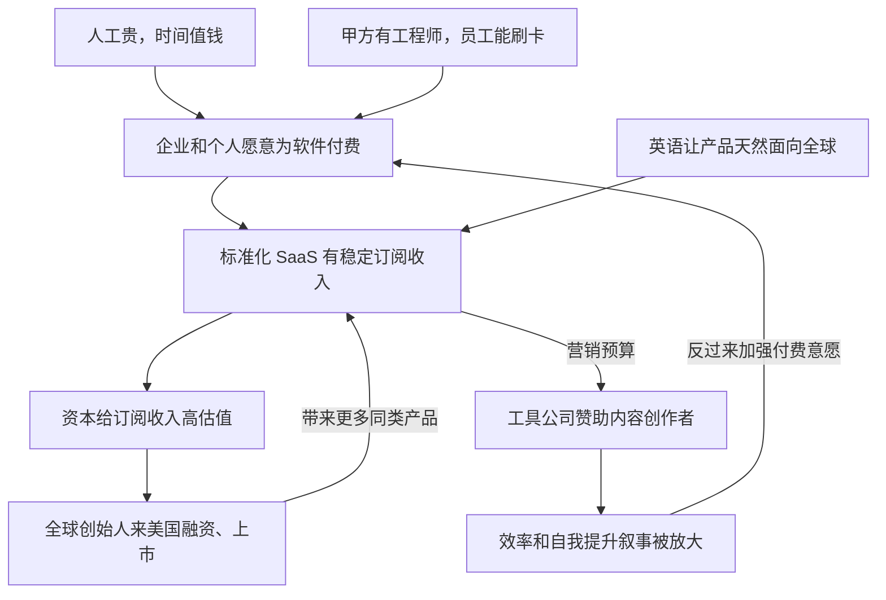

网上流行一种解释：美国人从清教徒那里继承了「工作是天职」的伦理，又有泰勒科学管理的传统，硅谷把「优化」推到极致，个人主义让每个人为自己的产出负责，所以美国做出了 Notion、Slack、Todoist、Linear 这一长串效率工具，YouTube 和 X 上也满是讲自我提升的博主，热度很高。这篇笔记检验这个说法是否成立，用东亚国家做对照，再看 AI 把这件事往哪里推。

我的结论是：现象成立，而且比直觉更集中，2024 年全球软件支出有一半以上发生在美国；但流行解释里的文化因素只能解释一半。韩国人的工作时长比美国人更长，中国和韩国受访者把工作放在第一位的比例远高于美国，东亚对自我提升的需求也很旺盛，却没有长出同等体量、卖向全球的效率软件产业。决定工具在哪里被做出来的，主要是买方和资本：美国劳动力贵，企业自己养工程师做选型，员工和小团队能直接刷卡买软件，盗版率低，资本市场愿意给订阅收入高估值，英语又让产品从第一天起就面向全球。文化塑造的是这些工具和内容的腔调，它以个人为优化单位，并且默认努力会有回报。

到了 AI 时代，这套格局在几个地方同时松动。效率工具正在从帮人管理时间的界面，变成替人完成工作的劳动力，收费从按席位转向按结果。造工具的地方和用工具的地方开始分开，美国做出了前沿模型，AI 普及率却排在韩国、新加坡和台湾之后，大量应用层产品由亚洲团队做出来卖给海外付费用户。自我提升叙事的对象也换了，从「怎样管好自己的时间」变成「能调动多少个智能体」和「什么是 AI 替代不了的」，焦虑并没有因此减少。

## 一、把这个说法拆成三句话

流行解释其实把三件事捆在了一起。第一件是生产：美国做出了数量最多、市值最高的 SaaS 和效率工具。第二件是内容：以英语输出的自我提升、效率优化内容体量巨大，热度很高。第三件是因果：前两件事来自清教徒伦理、泰勒主义、硅谷文化和个人主义。

前两句是事实判断，可以直接用数据核对。第三句是因果判断，核对它需要对照组。东亚正好是一个现成的对照组：日本、韩国、中国大陆的竞争强度和自我提升需求都不输美国，韩国的工作时长还比美国更长，如果文化是主因，这些地方应该也能长出同等规模的效率软件产业。另外还有两组「自然实验」可以用。印度的 SaaS 公司从创立起就把北美当主要市场；2024 年以后，一批中国团队做的 AI 应用直接面向海外用户收费。这些创始人的文化背景和清教徒毫无关系，产品形态和商业模式却和美国公司几乎一样。

还有一个口径问题要先说清楚。「美国」和「英语世界」在这个话题里经常被混用：做效率内容最有名的博主里有不少是英国人，很多「美国」效率工具的创始人来自加拿大、芬兰、乌克兰和中国。下文在需要区分的地方会分开说。

## 二、现象是真的：钱、公司和资本都集中在美国

S&P Global Market Intelligence 的数据（WIPO 在 2025 年 6 月引用）显示，2024 年全球软件支出约 6,750 亿美元，美国一家就有 3,685 亿美元，占 54% 以上；排第二的中国是 618 亿美元，约为美国的六分之一。美国也是唯一一个软件支出超过 GDP 1% 的经济体。公司数量是同样的形状：Statista 估计 2024 年全球约 30,800 家 SaaS 公司里，美国约 17,000 家，英国约 1,500 家，加拿大 992 家，印度 711 家（这是经二手引用的估算，只看量级）。按 CB Insights 的口径，2025 年全行业独角兽美国 712 家，中国 157 家，韩国 14 家，日本 9 家。BVP 新兴云计算指数在 2026 年 9 月有 66 家成分公司，没有一家来自中日韩（这个指数只收美国上市的公司，所以这一条部分反映的是上市地）。这几组都是全软件或全行业的口径，效率工具没有单独的统计，但方向是一致的。

中国的情况可以用一组数字概括。天翼智库 2023 年底的报告估算，2021 年中国 SaaS 市场规模 443 亿元，只有美国的 6.6%，发展阶段落后约十年，超过 58% 的大型企业更愿意自研或找第三方定制开发。艾瑞咨询给出的 2023 年中国企业级 SaaS 市场是 888 亿元。更直观的是钉钉：到 2023 年底，钉钉有 7 亿用户、2,500 万家组织，其中付费购买软件的企业 12 万家，按这两个数算，付费组织不到 0.5%。资本市场的结果也清楚，微盟股价从 2021 年高点的最大跌幅超过 95%，用友 2025 年仍亏损 13.89 亿元。金蝶在 2025 年实现了 2020 年以来的首次盈利，云业务占收入 82.5%，说明订阅模式在中国并非做不成，只是慢而难。

日本是另一种形状。IPA 用 2015 年数据做的国际比较显示，日本 72.0% 的 IT 人才在 IT 企业（系统集成商、外包商、软件公司）工作，美国只有 34.6%，德国 38.6%，法国 46.1%。换句话说，美国企业的软件大多由自己的工程师选型和搭建，日本企业的软件大多交给系统集成商（日本叫 SIer）按需定制。经产省 2018 年的 DX 报告警告，如果遗留系统不更新，2025 年以后每年可能损失最高 12 万亿日元。

日本的 SaaS 公司这几年增长很快。Sansan、freee、Money Forward 在 2025 到 2026 年间公布的年度数据里，收入增速在 24% 到 31% 之间，SmartHR 在 2026 年 7 月宣布 ARR 达到 300 亿日元；日本政府 2020 年清理行政手续，在 14,992 项需要盖章的规定里宣布废除 14,909 项。

所以第一句话成立，而且成立得很彻底。需要解释的不是「美国做得多一点」，而是软件产业为什么会集中到这种程度。

## 三、文化解释只对了一半

### 新教伦理：证据分成两边

韦伯的命题在经济学里被反复检验过，结论并不整齐。Becker 和 Woessmann 2009 年用 19 世纪普鲁士各县的数据、以到维滕贝格的距离作工具变量，发现新教地区确实更富裕，但差距主要来自识字率和教育，而不是工作伦理本身。Cantoni 2015 年用 1300 到 1900 年间 272 座城市的人口数据，找不到新教对经济增长的效应。另一边的证据同样存在：Spenkuch 用 1555 年《奥格斯堡和约》造成的宗教分布作工具变量，发现今天德国的新教徒仍然工作更长时间、总收入更高，但时薪没有差别，作者认为这种差异来自价值观，而不是制度或教育；van Hoorn 和 Maseland 对 82 个社会、15 万人的分析显示，失业对新教徒幸福感的打击更大。

合起来看，新教价值观对「一个人愿意工作多久、不工作时有多难受」有可测量的影响，对经济增长和产业形态的解释力弱得多。美国效率文化里确实能找到清教徒的影子。富兰克林在自传里记录了他的 13 项美德，每周专攻一项，用 7 列 13 行的表格记下每天的过失；他的作息表从早上 5 点起床、计划当天开始，早晨的问题是「今天我要做什么好事」，晚上回顾一天。这基本就是今天的习惯追踪加时间块。「时间就是金钱」出自他 1748 年的《给年轻商人的忠告》，不过这句话 1719 年已经在伦敦的刊物上出现过。

### 如果勤奋是原因，东亚应该做得更多

按 OECD 的数据，2025 年韩国每位就业者年均工作 1,833 小时，美国 1,800 小时，日本 1,598 小时，德国 1,332 小时。美国人工作时间长，但不是最长的（OECD 提示这组数只宜看相对位置）。韩国人比美国人工作得更久，年薪却低三成左右，勤奋程度和劳动力的价格是两回事。日本的过劳问题也没有消失，厚生劳动省公布的 2024 财年数据里，因工作导致精神疾病的工伤认定有 1,055 件，第一次超过 1,000 件，连续六年创新高。中国在 2019 年有 996.ICU 的讨论，2021 年最高人民法院明确 996 违法；韩国 2018 年把每周工时上限从 68 小时降到 52 小时，2023 年政府提出放宽到 69 小时，因年轻人和工会反对而撤回。

价值观调查给出的画面更反直觉。

世界价值观调查第 7 轮（伦敦国王学院 2023 年整理）里，同意「工作应当永远放在第一位」的比例，中国 82%，韩国 47%，德国 29%，美国 28%，日本 10%。认为「工作是对社会的责任」的，中国 83%，美国 59%，日本 58%。

个人主义的指标也不再支持流行解释。霍夫斯泰德的旧版分数里，美国个人主义 91 分，日本 46，韩国 18，中国 20，这组数常被拿来论证「美国人最个人主义」。2023 年 The Culture Factor 按 Minkov 和 Kaasa 的新方法更新之后，美国是 60，日本 62，韩国 58，中国 43，荷兰 100，德国 79，英国 76，官方还专门说明旧版的美国分数可能偏高。测量方法一换，美国就从遥遥领先变成和日韩几乎持平，这本身就说明拿这类指数解释产业分布要非常小心。

### 东亚的自我提升需求一点不弱

中国的知识付费在 2016 年以后爆发，得到 App 到 2021 年中累计激活 4,540 万次，樊登读书到 2022 年三季度会员超过 6,000 万。日本的《被讨厌的勇气》全球销量 1,350 万册，2015 年还是韩国的年度畅销书第一；Hobonichi 手帐 2026 年版发售后到 2026 年 1 月底卖出超过 100 万本，一半以上卖到海外。韩国从 2020 年开始流行「미라클모닝」（奇迹早晨）和「갓생」（像神一样自律地过日子），学习 vlog 和「study with me」自习视频也很火。

最能说明问题的是 Notion 的选择。Notion 在 2020 年 8 月推出的第一个外语版本是韩语，官方博客说韩国用户在产品本地化之前就已经写了 4 本教程书、自发办工作坊、做视频，韩国媒体报道的理由是韩国当时是它在美国以外用户最多的市场。2021 年 10 月日语测试版上线时，Notion 说日本已经是它的主要市场之一，一年里日活涨到原来的 4 倍，而当时 Notion 超过 80% 的用户在美国以外。再往前，2015 年第一版产品失败后，Ivan Zhao 和联合创始人搬到京都重写了 Notion，理由是那里的文化看重手艺。到 2026 年 4 月，Notion 说韩国在 Notion AI 采用率上排进全球前五。东亚用户很爱用效率工具，只是这些工具多数不是东亚公司做的。

### 文化到底解释了什么

文化没有决定软件产业落在哪里，但它塑造了美国效率文化的腔调。价值观那张图的右半边有一个实实在在的差异：同意「从长远看，努力工作通常会带来更好的生活」的，美国 55%，日本 29%，德国 28%，韩国只有 16%。自我提升内容卖的正是这个前提：个人的方法、习惯和工具可以改变个人的结果。

我的推测是，在多数人不相信个人努力能改变处境的社会里，自我提升会换一种形式出现，比如考试和组织内的晋升路径，或者纸质手帐这种不承诺结果、只承诺秩序的东西。中国受访者对「努力有回报」的认同（58%）和美国接近，这和中国知识付费、成功学的繁荣对得上；差别在于这股需求在中国变成了内容平台和课程，没有变成出口全球的软件公司。所以文化能解释这些东西的腔调，却解释不了它们为什么集中在美国被做出来、卖出去。

## 四、方法的国籍和产品的国籍

如果问这些效率方法是谁发明的，美国的位置就没有那么中心了。

番茄工作法是意大利人 Francesco Cirillo 在 1980 年代末想出来的，最初靠一份免费 PDF 传播，下载量过了 200 万之后，企鹅兰登旗下的 Currency 在 2018 年出了正式的英文书。卡片盒笔记法来自德国社会学家卢曼，他从 1951 年到 1996 年积累了约 9 万张卡片，这套方法在 2020 年前后随着 Roam Research、Obsidian 这类软件在英语互联网上走红。看板出自丰田，大野耐一在 1940 年代末到 1960 年代之间，参照美国超市的补货方式做出这套系统；「精益」这个词是 John Krafcik 1988 年在《斯隆管理评论》上提出的，1990 年 MIT 的《改变世界的机器》让它传遍全球，2011 年 Trello 把看板做成了人人能用的软件。

「改善」的来历更绕。它在日本推广的起点，是二战后美国引入的 TWI（Training Within Industry）培训项目，1951 年的一部教学影片把它带进日本工厂，日本企业把它发展成持续改进的管理文化；1986 年今井正明的英文书《Kaizen》由 McGraw-Hill 出版，这个词才成为全球管理学的通用词。泰勒的科学管理则是反方向的例子：1911 年在美国出版，1912 年上野阳一就把它引入日本，1913 年有了日译本，1918 年列宁在《苏维埃政权的当前任务》里号召苏俄研究和采用泰勒制。

美国自己发明的方法也不少，富兰克林的美德表、艾森豪威尔 1954 年讲的「紧急与重要」、英特尔 Grove 在 1970 年代做的 OKR 前身、David Allen 2001 年的 GTD 都是。但美国更突出的能力在后半段：把一个方法变成书、课程、咨询和软件，然后卖给全世界。柯维 1989 年用四象限包装了「紧急与重要」，《高效能人士的七个习惯》到 2012 年卖出 2,000 万册以上；John Doerr 1999 年把 OKR 带进 Google，2018 年写成《Measure What Matters》；《掌控习惯》的作者官网说这本书全球销量超过 3,000 万册，翻译成 60 多种语言。

这张图说明的是一种分工：方法可以在任何地方诞生，把方法做成规模化生意的环节集中在英语市场。这和第二节看到的软件产业分布是同一个形状。

工具本身也是这个形状。很多被当成「美国效率工具」的产品，创始人并不是在美国长大的。Notion 的 Ivan Zhao 生在新疆乌鲁木齐，高中时移居温哥华；Zoom 的袁征来自山东泰安，1997 年去了硅谷；Slack 的前身 Tiny Speck 2009 年在温哥华成立，创始人 Stewart Butterfield 是加拿大人；Grammarly 2009 年由三个乌克兰人在基辅创立；Miro 2011 年诞生在俄罗斯彼尔姆，后来把总部放到阿姆斯特丹和旧金山，2022 年关掉了彼尔姆的办公室；Linear 的三位创始人是芬兰人，CEO Karri Saarinen 2012 年借着 Y Combinator 搬到旧金山；Todoist 的创始人 Amir Salihefendic 生在波斯尼亚、长在丹麦；Obsidian 的两位作者出自加拿大滑铁卢大学。澳大利亚的 Atlassian 和 Canva 总部仍在悉尼，但 Atlassian 2025 财年约 42% 的收入来自美国；Zoom 同一财年来自亚太和欧洲中东非洲的收入加起来只占 28.2%。

中国团队做的效率工具里，这个规律更明显。XMind 2006 年在深圳创立，创始人孙方后来说，付费软件在海外更有土壤，公司头十年主要做海外市场，到 2020 年前后国内和海外收入才大约各占一半。滴答清单的海外版 TickTick 由香港主体运营，AFFiNE 的公司注册在新加坡，Logseq 早期的用户也以海外英语用户为主。HeyGen 2020 年由两位中国创始人在深圳起步，2022 年把总部搬到洛杉矶；Genspark 由前百度高管景鲲等人 2023 年在帕洛阿尔托创办，主攻美国市场。袁征讲过自己去硅谷的起因：年轻时在一次行业展会上听了比尔·盖茨的主题演讲，觉得互联网是未来，「也许我该去硅谷看看」。人跟着市场和资本走，工具的「国籍」于是落在了美国。

## 五、真正的发动机：谁付钱、付多少、怎么被定价

把文化因素放到一边，剩下的变量都指向同一个方向：美国是全球最大、最愿意为软件付钱、而且付钱方式最适合标准化产品的市场。

### 人贵，软件就显得便宜

OECD 的数据里，2025 年美国全职员工平均年薪 86,977 美元（购买力平价），韩国 61,259 美元，日本 50,183 美元。国家统计局公布的 2025 年城镇非私营单位平均工资是 129,441 元，私营单位 71,590 元。按日本生产性本部的测算，2024 年美国每小时劳动创造的 GDP 是 116.5 美元（购买力平价），OECD 平均 79.4 美元，日本 60.1 美元，韩国 57.5 美元。美国人的一小时是全世界最贵的一小时之一。一个每月几十美元的软件席位，如果能替一个人省下几个小时，在美国几乎不用算账；在人工便宜的地方，老板更常见的选择是多招一个人。陈果 2024 年举过一个对比：一套 ERP 在中国的实施费用大约 500 万元，北美类似的项目大约 3,000 万美元。价格被压到这个程度，软件公司很难养活标准化产品的研发。

劳动力贵是必要条件，但不充分。德国员工平均年薪 76,285 美元，工作时长在 OECD 里属于最短的一档，按理说最有动力买软件替代人工，德国却没有长出和美国同等规模的 SaaS 产业。欧洲有 SAP，也有不少效率工具公司，我认为它缺的是另外两样东西：一个语言统一的大市场，和一个愿意给亏损的订阅公司高估值的资本市场。英国是另一个对照：同样说英语、人工也贵，按 Statista 的估算有约 1,500 家 SaaS 公司，按人口折算还不到美国的一半。语言和工资之外，本土市场的体量和资本的深度同样关键。

### 买方结构：甲方有工程师，员工能刷卡

软件怎么被买，决定了什么样的软件能卖出去。美国约三分之二的 IT 人才在用户企业里，这些人有能力评估、试用、接入一个标准化 SaaS，不需要供应商派人驻场定制。一个五人小组今天注册、明天刷卡就能用上 Notion 或 Linear，产品可以靠用户自下而上地扩散，不必先搞定采购委员会。硅谷把这叫产品驱动增长（PLG），它成立的前提就是这种买方结构。

中国和日本的买方结构正好相反。天翼智库的调研里超过 58% 的大型企业倾向自研或定制，日本 72% 的 IT 人才在乙方。买软件常常由老板或信息部门拍板，要的是「按我的流程改」，标准化产品在这里吃亏。付费习惯也不一样：BSA 2018 年全球软件调查的数据（其中部分国家的数字来自二手引用）显示，2017 年电脑上未经授权的软件比例，美国约 15%，日本 16%，中国 66%，印度 56%，全球平均 37%。平台公司的免费策略又把问题放大了，钉钉、企业微信、飞书把协同办公做成了巨头生态的一部分，企业微信 2025 年说服务的企业和组织超过 1,400 万家，钉钉 2,500 万家组织里付费的只有 12 万家。独立的效率工具很难和免费的全家桶竞争。

### 资本会给订阅收入定价

美国资本市场长期愿意为高毛利、高留存的订阅收入付高倍数，直到 2026 年初，软件板块的远期市盈率才第一次跌到与标普 500 持平。一家公司可以连续多年亏损扩张，只要净收入留存率好看。这让创始人有动力做标准化的效率工具，也让风险投资愿意在一个细分品类里同时押好几家。BVP 新兴云计算指数里没有中日韩公司，港股的微盟从 2021 年高点最多跌去 95% 以上（其中也有它自身的原因，2024 年收入下降 39.9%、亏损 17.44 亿元）。这两件事至少部分指向同一个方向：资本愿意在哪里给估值，创业者就更可能去哪里做产品。

### 英语是默认市场

最有说服力的是开头提到的两组自然实验。贝恩 2022 年的报告说，印度 SaaS 行业 ARR 约 120 到 130 亿美元，只有约 20% 的收入来自印度本土；Freshworks 2025 财年 8.388 亿美元的收入里，北美占 46.6%；Zoho 2025 财年的收入里，北美占 41%，亚洲占 30%。印度创始人不需要信清教，只要产品能用英语卖给北美客户，就能做成和美国公司一个形状的 SaaS。

AI 时代的中国团队走了同一条路。HeyGen 由中国创始人在深圳起步、后来把总部搬到洛杉矶，2026 年 6 月 ARR 达到 2 亿美元。同样背景的团队，面对国内免费的超级应用很难收费，面对海外付费用户就能做出上亿美元的年收入。几个案例证明不了单一变量，但最明显的差别在买方。

把这几条连起来，是一个会自我加强的循环：

## 六、内容飞轮：英语自我提升博主为什么这么热

2026 年 9 月，Steven Bartlett 的访谈节目 The Diary of a CEO 在 YouTube 上有 1,960 万订阅，神经科学家 Andrew Huberman 的 Huberman Lab 有 784 万，Ali Abdaal 669 万，Mel Robbins 617 万，Alex Hormozi 448 万，Matt D'Avella 约 404 万（8 月中旬的计数），Thomas Frank 301 万。其中 Bartlett 和 Abdaal 是英国人，图里的 Chris Williamson 也是英国人，讲学习方法的 Justin Sung 在新西兰，所以更准确的说法是英语世界，不只是美国。

把东亚放进来，画面就不是一边倒了。

日本讲个人理财和自我提升的「両学長 リベラルアーツ大学」有 976 万订阅，比 Ali Abdaal 还多；搞笑艺人中田敦彦做的知识讲解频道有 548 万。韩国讲赚钱和自我提升的「신사임당」有 282 万，「김작가 TV」约 273 万。日本人口约 1.2 亿，韩国约 5,100 万，而英语博主面对的是全球英语观众，按潜在观众的规模算，日韩头部频道的覆盖程度要高得多。中国的对应物在 B 站：陈睿 2021 年说泛知识内容占 B 站视频播放量的 45%，2023 年的一份行业报告说过去一年有 2.43 亿用户在 B 站看过知识类内容，讲刑法的罗翔在 2026 年初有 3,208 万粉丝。东亚观众对「让自己变得更好」的内容同样买账。市场规模的估算也指向同一件事：Grand View Research 估计 2025 年全球个人发展市场约 510 亿美元，北美只占 34.8%，而美国一家就占了全球软件支出的一半以上。对自我提升的需求分布得比软件产业均匀得多。

差别在钱，以及内容能卖到多远。

谷歌不公布分国家的广告单价，第三方估算之间常常差一倍，只能看量级。按 Lenos 2026 年 4 月的估算，观众在美国时，创作者每千次播放大约拿到 10.81 美元，英国 7.12 美元，日本 2.90 美元，印度 0.46 美元，菲律宾 0.15 美元。Business Insider 核对过 Ali Abdaal 的后台数据，他的频道 2022 年平均每千次播放收入是 8.23 美元。同样的内容，面向英语观众时，每次播放的价值是日本观众的几倍、东南亚观众的几十倍。这决定了谁有预算养团队、做剪辑、做研究，也决定了这个品类能吸引多少人进来。

钱还有第二个来源，就是工具公司本身。Notion 官方联盟计划给推荐人每个激活的注册最高 50 美元，再加上客户第一年收入的 20%，另外还有面向创作者的 Builders 计划和模板市场。Influencer Marketing Hub 和 NeoReach 对 3,000 多名创作者的 2025 年调查里，超过 49% 的人主要收入来自品牌合作。Ali Abdaal 在公开 2022 年收入的视频里列过明细（这里用的是第三方根据视频整理的数字，仅供参考）：总收入约 460 万美元，其中 YouTube 广告约 65 万，视频赞助约 60 万，Skillshare 约 78 万，最大的一块是教人做 YouTube 的课程 Part-Time YouTuber Academy，约 176 万。至少在 Ali Abdaal 身上，这门生意绕成了一个圈：用效率内容吸引观众，用赞助和联盟佣金变现，再把「怎样成为效率博主」做成课程卖给下一批想进来的人，而课程才是最大的收入来源。第五节那张循环图里「工具公司赞助内容创作者」这一环，指的就是这件事。

最后一个变量是信念。第三节提到，美国 55% 的受访者相信努力通常会带来更好的生活，韩国只有 16%。自我提升内容卖的是一种因果承诺：换个习惯、换套系统、换个工具，结果就会不同。相信这个承诺的人越多，这类内容越容易被当成「投资自己」而不是鸡汤。不过日韩头部频道的体量说明，这个信念差异影响的更多是内容的口吻和题材，而不是需求本身。让英语自我提升内容压过其他语言的，是更高的广告单价、工具公司的赞助预算，以及一个覆盖全球的观众池。

## 七、反面：工具的繁荣没有兑现为宏观效率

效率工具行业有一个尴尬的背景：它最繁荣的年代，恰好是美国生产率增长最慢的年代之一。

美国劳工统计局按经济周期计算的非农企业部门劳动生产率，1947 到 1973 年平均每年增长 2.7%，2001 到 2007 年 2.8%；2007 年底到 2019 年底只有 1.5%，是二战后倒数第二慢的一段。这十二年正是 iPhone 普及，Slack、Notion、Asana 这类协作和效率软件大量出现的时候。2019 年底以来的这一轮周期回升到 2.1%，2024 年全年 3.0%，但堪萨斯城联储的分析认为这轮提升很难归功于 AI（见第八节）。这组数字不能证明效率工具拖慢了生产率，同一时期还有金融危机和之后的投资疲软等许多因素；它能说明的是，工具的繁荣没有在宏观上兑现为效率的繁荣。1987 年 7 月，索洛在《纽约时报书评》上写过一句后来被反复引用的话：计算机时代无处不在，唯独不在生产率统计里。这句话放到 SaaS 身上也说得通。

微观数据解释了一部分原因。《哈佛商业评论》2022 年 8 月发表的一项研究，跟踪了 3 家财富 500 强公司的 20 个团队、137 名员工，累计 3,200 个工作日：员工每天在不同应用和网站之间切换约 1,200 次，每次切换后重新进入状态要两秒多，累加起来每周接近 4 小时，约占工作时间的 9%。Asana 2023 年对 6 个国家 9,615 名知识工作者的调查显示，人们 58% 的时间花在「关于工作的工作」上，比如找信息、追进度、在工具之间来回切换，专业工作占 33%，战略性工作只有 9%。工具的数量还在涨：Okta 的客户在 2024 年平均接入 101 个应用，第一次超过 100；Zylo 统计企业实际购买的软件许可，2025 年平均每家组织有 305 个 SaaS 应用（两家的统计口径不同，不能直接比）。每个工具都在局部省时间，合起来又制造了新的协调成本。

批评一直存在，而且主要来自英语世界内部。Merlin Mann 很早就用「productivity porn」形容那种把阅读效率技巧当成效率本身的消费；Tim Kreider 2012 年在《纽约时报》写《忙碌陷阱》，说很多白领的忙是一种自我标榜；Derek Thompson 2019 年在《大西洋月刊》把美国精英对工作的狂热称为「工作教」（workism）；Cal Newport 2021 年在《纽约客》写道，知识工作者已经厌倦了「个人效率」这个说法，问题应该回到组织和系统层面去解决。Anne Helen Petersen 2019 年写千禧一代倦怠的长文、Oliver Burkeman 2021 年的《四千周》，都属于同一股思潮。2022 年「安静辞职」在 TikTok 上走红，盖洛普当年的调查估计，美国员工里至少一半是只做分内事的「安静辞职者」。

东亚有自己的版本。中国 2021 年流行「躺平」，随后被监管要求降温；日本 2013 年的流行语候选里有「さとり世代」，指对消费和上进都兴致不高的年轻人；韩国从 2011 年的「三抛世代」一路演变到「N抛世代」。它们和美国的反效率思潮方向相近，出发点不同。美国的批评针对的是「个人应当无限优化自己」这个承诺本身，东亚的版本更多是在回应「努力也换不来回报」。日韩受访者对努力回报的低认同和这个判断对得上；中国受访者在 2018 年的调查里对努力回报的认同反而很高，躺平在 2021 年才流行，我推测它反映的更多是那几年处境的变化。

## 八、AI 时代：重心往哪里移

### 从工具到劳动力

2024 年 12 月，微软 CEO 纳德拉在 BG2 播客里说（据第三方整理的文字稿），商业应用本质上是带业务逻辑的增删改查数据库，这些逻辑会移到 AI 层，商业应用在智能体时代可能会塌缩。Foundation Capital 同年提出「服务即软件」：AI 要抢的不是约 2,000 亿美元的 SaaS 市场，而是 2.3 万亿美元的薪酬加 2.3 万亿美元的外包服务。两种说法指向同一件事：效率工具过去卖的是让人更快的界面，接下来卖的是替人完成的工作。

资本市场在 2026 年初给这个判断定了一次价。1 月底，Anthropic 为 Claude Cowork 发布了法务、财务、数据等插件，2 月 3 日 Thomson Reuters 盘中最多跌 18%，RELX 跌 14%，Wolters Kluwer 跌 13%；据彭博报道，这轮下跌是财报疲弱、模型变强和 Anthropic 插件三者叠加的结果。软件股 ETF IGV 从前高到 2026 年 4 月 10 日的低点累计下跌 36.6%，软件板块长期享有的估值溢价一度消失。此后 IGV 反弹了近 46%，Atlassian 从高点跌去 66.5% 之后又涨了 194%。这更像一次重新定价，SaaS 并没有消失。

计费方式的变化更实在。Intercom 的 AI 客服 Fin 按每次成功解决问题收 0.99 美元，而人工坐席的席位价是每月 29 到 132 美元；公司后来直接改名为 Fin，2026 年 6 月与 Salesforce 达成约 36 亿美元的收购协议。Salesforce 自己的 Agentforce 在两年里用过三种计价：按对话 2 美元，按动作 0.1 美元的额度，再加上按人头的许可证。AI 原生工具的增长曲线和席位型 SaaS 不在一个量级：Lovable 从 1 亿美元 ARR 到 4 亿美元用了七个月，当时公司只有 146 名员工；Cursor 在 2026 年 2 月的年化收入达到 20 亿美元。

### 效率的证据比效率的叙事慢

METR 在 2025 年 7 月发表的随机对照试验里，16 名资深开源开发者完成 246 个真实任务，使用 AI 工具时完成时间反而延长了 19%；他们事前预计会快 24%，做完后仍然觉得快了 20%。2026 年 2 月 METR 发布了更新，新一轮研究的点估计转为加速（老参与者完成时间缩短 18%，但置信区间跨过零），同时发现 30% 到 50% 的开发者会回避那些不用 AI 就不愿做的任务，研究团队自己也说这个信号不可靠。

其他证据的方向同样不一致。Brynjolfsson 等人对 5,179 名客服的研究发现，每小时解决的问题数平均提高 14%，新手提高 34%，老手几乎没有变化。MIT NANDA 2025 年的报告说，企业在生成式 AI 上花了 300 到 400 亿美元，95% 没有看到可衡量的业务回报。宏观上，美国 2026 年二季度劳动生产率年化增长 1.4%，劳动收入份额降到 52.9%，是 1947 年以来最低；堪萨斯城联储的分析认为，AI 采用对总体生产率提升的解释力很小。

这和效率工具的老问题是同一个：人对「我更高效了」的感受，比生产率统计来得快，也来得乐观。

### 造的地方和用的地方分开了

微软 AI 经济研究院公开的数据显示，2026 年一季度劳动年龄人口里用过生成式 AI 的比例，阿联酋 70.1%，新加坡 63.4%，韩国 37.1%，台湾 31.8%，美国 31.3%，在有数据的 147 个经济体里排第 21 位（排名按公开数据集自行排序）；日本 22.5%，中国大陆 16.4%。这个指标由微软的匿名遥测数据推算，再按操作系统和设备份额、互联网普及率和人口做调整，我的判断是它对以本土应用为主的中国大陆会有低估。Anthropic 2025 年 9 月的人均使用指数给出相近的排序：以色列 7.0，新加坡 4.57，韩国 3.73，美国 3.62，日本 1.86。韩国的付费意愿同样突出，OpenAI 在 2025 年说韩国的 ChatGPT 付费用户数仅次于美国。

中国大陆走的是另一条路。QuestMobile 统计 2026 年 5 月 AI 原生应用月活 4.99 亿，其中豆包 3.82 亿、千问 1.67 亿、DeepSeek 1.3 亿，主力产品基本免费。国务院 2025 年 8 月印发的「人工智能+」行动意见提出，2027 年智能终端和智能体的普及率超过 70%，2030 年超过 90%。同时，中国团队做的 AI 应用在海外很能赚钱：a16z 2025 年 8 月的榜单里，全球前 50 的移动端生成式 AI 应用有 22 个由中国团队开发，其中只有 3 个主要在中国使用；MiniMax 2026 年上半年收入的 60.8% 来自海外。这条路也开始有政治成本。Manus 在 2025 年把总部迁到新加坡，年底被 Meta 以约 20 亿美元收购，2026 年 4 月中国发改委叫停了这笔交易。

日本的动力来自缺人。2026 年 2 月的一项调查里，78.6% 的管理者说人手不足；帝国数据银行 2026 年 3 月对一万多家企业的调查显示，使用生成式 AI 的企业比例首次超过三成，达到 34.6%。孙正义在 2025 年 7 月说软银集团要部署 10 亿个智能体，平均每名员工约 1,000 个，每个每月成本约 40 日元。对日本来说，AI 更像劳动力的补充，而不是个人效率的升级。

### 自我提升叙事换了对象

自我提升内容也在转向。Sam Altman 在 2023 年说，他和一些 CEO 朋友有个赌局，赌第一家只有一个人的十亿美元公司什么时候出现；Lovable 用 146 人做到 4 亿美元 ARR，让这个说法显得不再遥远。「我怎样更高效」正在变成「我能调动多少个智能体」。另一面是焦虑：皮尤 2025 年的调查里，52% 的美国在职者担心 AI 对工作的影响；2026 年 8 月的调查里，71% 的美国人预计 AI 会让工作岗位变少。

优化的对象也在往身体上移。Bryan Johnson 的 Blueprint 在 2025 年 10 月融资 6,000 万美元，计划做 AI 健康助手。认知外包的代价开始被讨论，MIT 媒体实验室 2025 年的一篇预印本发现，用大模型写作的那组人大脑连接最弱。这项研究样本小，也还没有经过同行评审，但它提出的问题很直接：如果思考本身被外包出去，自我提升到底要提升什么。

## 九、会走向何方

下面几个判断，按我的把握程度从高到低排。

第一，效率工具的主语会从人变成智能体。过去十几年的效率工具，核心是帮一个知识工作者管理任务、文档、日程和注意力，收入按人头算。智能体接手执行以后，工具的价值要按完成了多少工作来衡量。席位制不会一夜消失，Salesforce 现在就是三种计价并存，但估值逻辑已经变了，2026 年上半年的软件股下跌，部分就是市场在重算这件事。受冲击最大的是那些本来就是「给人用的表单加流程」的产品；数据、权限和分发这些智能体绕不过去的环节，价值反而会上升。

第二，美国的优势会从应用层往两头走：往下是模型和算力，往上是付费市场本身。应用层会变成全球创始人争夺美国付费用户的场地，中国、印度、欧洲的团队在这里并不吃亏，开源模型还降低了门槛，OpenRouter 和 a16z 的统计显示，中国开源模型在 2025 年里从约 1% 涨到每周平均 13% 的 token 份额。但 Manus 收购被叫停说明，「国内团队、海外公司、卖给美国」这条路的地缘成本在上升，以后会有更多团队在一开始就选边。

第三，东亚会在「用」上反超，但赚钱的方式不会照搬美国。韩国、新加坡、台湾的普及率已经高于美国，日本的普及率增长很快，还有缺人这个硬需求，孙正义那句「每个员工一千个智能体」背后是人口结构。中国大陆大概率重演 SaaS 时代的格局：豆包、千问这类超级应用免费提供能力，钱沉淀在云、终端和平台里，而不是独立效率工具的订阅里。对中国的独立开发者来说，最现实的付费市场仍然在海外。

第四，自我提升内容会从「怎样更高效」转向「做什么值得做」和「怎样不被替代」。执行变便宜以后，稀缺的是判断、品味、提出正确问题的能力，还有身体和注意力这些 AI 替不了的东西。效率崇拜不会消失，它的对象从自己的时间换成了智能体的产出，节奏只会更快。英语世界的博主仍会拿走最大的流量，但剪辑、翻译、配音这些供给门槛正在被 AI 抹平，东亚创作者进入英语市场会比过去容易得多。

最大的不确定性在证据本身。METR 的结果在半年里就从「变慢 19%」变成「可能在加速」，关于 AI 效率的任何结论都过期得很快。如果几年后宏观生产率里仍然看不到 AI，那是索洛悖论的重演；如果看得到，劳动收入份额下降带来的分配问题，可能比「效率」本身更早成为舆论的中心。

## 十、结论

「美国人更勤奋、更信清教伦理，所以爱做效率工具」这个说法，描述对了现象，找错了主要原因。东亚的对照组显示，勤奋和对自我提升的渴望在亚洲一点不少；印度 SaaS 和中国出海 AI 应用显示，面对美国买方的团队，不管来自什么文化背景，做出的产品形态都高度相似。美国真正独特的是一个组合：昂贵的劳动力、自己有工程师的甲方、能刷卡的员工、低盗版率、会给订阅收入定价的资本，以及英语带来的全球市场。文化让这个市场里的工具和内容带上了「个人努力可以改变结果」的腔调。

AI 正在拆开这个组合里的几个零件。替代劳动力的成本开始由 token 价格决定，工具卖给人还是卖给智能体决定了收费方式，普及率最高的地方也不再是造工具的地方。效率工具这个行业大概率会继续以美国为最大市场，但「美国式效率文化」会越来越像一种全球通用的商业语言，和某个国家的民族性格关系不大。

## 参考资料

### 产业与市场

- S&P Global Market Intelligence 数据，WIPO Global Innovation Index 博客，2025-06-02：https://www.wipo.int/en/web/global-innovation-index/w/blogs/2025/global-software-spending
- Statista 的 SaaS 公司数量估算，经 Ascendix 引用：https://ascendixtech.com/number-saas-companies-statistics/
- CB Insights 独角兽数据，经 World Population Review 引用：https://worldpopulationreview.com/country-rankings/unicorns-by-country
- BVP Nasdaq Emerging Cloud Index 成分公司：https://cloudindex.bvp.com/companies
- 天翼智库，中国 SaaS 产业发展研究，2023-12-01：https://www.secrss.com/articles/61285
- 艾瑞咨询，中国企业级 SaaS 市场规模，澎湃新闻 2024-05-08：https://m.thepaper.cn/newsDetail_forward_27296049
- 陈果谈 IT 服务价格战与 ERP 实施费用，牛透社 2024-07-24：https://www.niutoushe.com/92278
- 钉钉 2023 年用户、组织与付费企业数，新京报 2024-01-09：https://m.bjnews.com.cn/detail/1704788856169873.html
- 企业微信 2025 年服务企业数，新浪财经 2025-08-20：http://finance.sina.com.cn/jjxw/2025-08-20/doc-infmrakf1823652.shtml
- 微盟股价与业绩，新浪财经 2025-01-13：https://finance.sina.com.cn/stock/relnews/hk/2025-01-13/doc-ineeutxc2306526.shtml
- 金蝶 2025 年业绩：https://m.kingdee.com/resources/articles/1483562803536758273
- 用友 2025 年业绩，新浪财经 2026-04-17：https://finance.sina.com.cn/stock/relnews/cn/2026-04-17/doc-inhuvkwy3128779.shtml
- 日本总务省《情报通信白皮书》令和元年版，图 2-3-1-6（IPA 2015 年数据）：https://www.soumu.go.jp/johotsusintokei/whitepaper/ja/r01/html/nd123120.html
- 经产省 DX 报告「2025 年の崖」，日经 xTECH 2018-09-07：https://xtech.nikkei.com/atcl/nxt/news/18/02581/
- SmartHR ARR 300 亿日元，2026-07-07：https://smarthr.jp/release/20260707/
- 日本行政手续废除盖章，ITmedia 2020-11-13：https://www.itmedia.co.jp/news/articles/2011/13/news136.html
- Bain，India SaaS Report 2022：https://www.bain.com/insights/india-saas-report-2022/
- Freshworks 2025 财年分地区收入（SEC 10-K）：https://www.sec.gov/Archives/edgar/data/1544522/000154452226000036/R72.htm
- Zoho FY25 财务，Entrackr 2026-04-08：https://entrackr.com/fintrackr/zoho-reports-rs-12313-cr-revenue-and-rs-3191-cr-profit-in-fy25-11701761
- 国家统计局，2025 年城镇单位就业人员平均工资，2026-05-15：https://www.stats.gov.cn/sj/zxfbhjd/202605/t20260515_1963707.html
- OECD Data Explorer：Average annual wages；Hours worked
- 日本生产性本部《労働生産性の国際比較 2025》：https://www.jpc-net.jp/research/assets/pdf/summary2025.pdf
- BSA，2018 Global Software Survey：https://www.bsa.org/reports/2018-bsa-global-software-survey

### 文化与历史

- Becker, Woessmann (2009). Was Weber Wrong? A Human Capital Theory of Protestant Economic History. QJE 124(2)：https://wrap.warwick.ac.uk/id/eprint/42282/
- Cantoni (2015). The Economic Effects of the Protestant Reformation. JEEA 13(4)：https://ideas.repec.org/p/lmu/muenec/14811.html
- Spenkuch (2017). Religion and Work: Micro Evidence from Contemporary Germany. JEBO 135：https://mpra.ub.uni-muenchen.de/29739/
- van Hoorn, Maseland (2013). Does a Protestant work ethic exist? JEBO 91：https://research.rug.nl/en/publications/does-a-protestant-work-ethic-exist-evidence-from-the-well-being-e/
- Benjamin Franklin, Autobiography（美德表与作息表）：http://ushistory.org/historic-personages/franklin/autobiography/page38.htm
- Quote Investigator，Time is money：https://quoteinvestigator.com/2010/05/14/time-is-money/
- King's College London Policy Institute，What the world thinks about work，2023-09-07：https://www.kcl.ac.uk/policy-institute/assets/what-the-world-thinks-about-work.pdf
- The Culture Factor，Country comparison tool（2023 年更新）：https://www.theculturefactor.com/country-comparison-tool
- 日本 2024 财年过劳工伤认定，PSRN 2025-06-25：https://www.psrn.jp/topics/detail.php?id=37029
- 996.ICU：https://github.com/996icu/996.ICU
- 韩国每周 52 小时工作制：https://www.korea.kr/special/policyCurationView.do?newsId=148855270
- 韩国 69 小时工作周提案撤回，HR Brew 2023-03-27：https://www.hr-brew.com/stories/2023/03/27/world-of-hr-south-korean-government-abandons-69-hour-workweek-plan
- 思维造物（得到）招股书数据，新浪科技 2022-01-24：https://finance.sina.com.cn/tech/2022-01-24/doc-ikyakumy2229896.shtml
- 樊登读书会员数，人人都是产品经理：https://www.woshipm.com/pd/5664011.html
- 《嫌われる勇気》销量：https://ja.wikipedia.org/wiki/嫌われる勇気
- Hobonichi 手帐 2026 年版破百万，FASHIONSNAP 2026-02-18：https://www.fashionsnap.com/article/2026-02-18/2026-hobonichi-1million/
- 미라클모닝 流行，京乡新闻 2021-01-18：https://www.khan.co.kr/article/202101180600015
- Notion 推出韩语版，The Investor 2020：https://www.theinvestor.co.kr/article/2391865
- Notion 推出日语测试版，2021-10-12：https://finance.yahoo.com/news/notion-expands-international-reach-launching-220000075.html
- Notion AI 在韩国的采用率，亚洲经济 2026-04-21：https://www.asiae.co.kr/en/article/2026042116305123495

### 方法的来历

- Lean Enterprise Institute，Kaizen 与 TWI 的渊源：https://www.lean.org/downloads/105.pdf
- Lean manufacturing（Krafcik 1988，MIT 1990）：https://en.wikipedia.org/wiki/Lean_manufacturing
- Bielefeld University，Niklas Luhmann Archive：https://www.uni-bielefeld.de/fakultaeten/soziologie/forschung/luhmann-archiv/
- Quote Investigator，艾森豪威尔「紧急与重要」：https://quoteinvestigator.com/2014/05/09/urgent/
- Objectives and key results（Grove、Doerr）：https://en.wikipedia.org/wiki/Objectives_and_key_results
- Francesco Cirillo 与番茄工作法：https://www.pomodorotechnique.com/francesco-cirillo/
- The Pomodoro Technique，Currency 2018-08-14：https://www.penguinrandomhouse.com/books/555557/the-pomodoro-technique-by-francesco-cirillo/
- Tsutsui (2001). The Way of Efficiency: Ueno Yoichi and Scientific Management in Twentieth-Century Japan. Modern Asian Studies 35(2)：https://www.cambridge.org/core/journals/modern-asian-studies/article/way-of-efficiency-ueno-yoichi-and-scientific-management-in-twentiethcentury-japan/43B40EA4DE9BA1C2FA907753C18A88DA
- Lenin (1918). The Immediate Tasks of the Soviet Government：https://www.marxists.org/archive/lenin/works/1918/mar/x03.htm

### 工具与创始人

- Sequoia，Notion 创始人访谈：https://sequoiacap.com/article/notion-spotlight/
- Notion，韩语版发布，2020-08-10：https://www.notion.com/releases/2020-08-10 ；日语测试版博客，2021-10-13：https://www.notion.com/blog/notion-launching-in-japanese
- Sequoia，Eric Yuan 访谈：https://sequoiacap.com/article/eric-yuan-zoom-spotlight/ ；Zoom 2025 财年 10-K：https://www.sec.gov/Archives/edgar/data/1585521/000158552125000042/zm-20250131.htm
- Slack Technologies：https://en.wikipedia.org/wiki/Slack_Technologies
- CNBC，Grammarly 的来历，2025-01-28：https://www.cnbc.com/2025/01/28/how-grammarly-went-from-nearly-broke-to-multibillion-dollar-ai-company.html
- Miro 公司介绍：https://miro.com/about/ ；Business Insider，Miro 关闭彼尔姆办公室，2022：https://www.businessinsider.com/miro-cuts-ties-russia-closes-office-in-perm-2022-4
- First Round Review，Inside Linear：https://review.firstround.com/podcast/inside-linear-why-craft-and-focus-still-win-in-product-building/
- Atlassian 2025 财年 10-K：https://www.sec.gov/Archives/edgar/data/1650372/000165037225000036/team-20250630.htm
- Future Startup，Amir Salihefendic 访谈，2023-02-14：https://futurestartup.com/2023/02/14/amir-salihefendic-doist/
- Obsidian 介绍与 v0.0.1 发布记录（2020-03-30）：https://obsidian.md/about ；https://obsidian.md/changelog/2020-03-30-desktop-v0.0.1/
- Joel Spolsky，Announcing Trello，2011-09-13：https://www.joelonsoftware.com/2011/09/13/announcing-trello/
- 21 世纪经济报道，XMind 的出海路径，2024-08-19：https://www.21jingji.com/article/20240819/herald/94dd2cc4bec57bd38c66e86623bf63fb.html
- TickTick 关于页：https://ticktick.com/about?language=zh_cn
- AFFiNE 关于页：https://affine.pro/about-us
- Logseq 融资公告：https://blog.logseq.com/logseq-raises-4-1m-to-accelerate-growth-of-the-new-world-knowledge-graph/
- SCMP，HeyGen 转向海外融资：https://www.scmp.com/tech/tech-trends/article/3267861/ai-start-heygen-raises-us60-million-after-pivoting-away-mainland-china-investors
- Reuters，Genspark 种子轮融资，2024-06-18：https://www.reuters.com/technology/artificial-intelligence/ai-search-startup-genspark-raises-60-million-seed-round-challenge-google-2024-06-18/

### 内容与创作者

- Social Blade 频道数据（The Diary of a CEO、Ali Abdaal、Mel Robbins、Alex Hormozi、Mark Manson、Thomas Frank、Tim Ferriss、Tiago Forte、両学長 リベラルアーツ大学、中田敦彦のYouTube大学、マコなり社長），2026-09-15：https://socialblade.com/
- Huberman Lab 频道页：https://www.youtube.com/@hubermanlab
- 신사임당 频道数据，Socialcounts：https://socialcounts.org/youtube-channel-analytics/UCaJdckl6MBdDPDf75Ec_bJA
- 김작가 TV，IMR 2026-09-11：https://imr.kr/2026/09/11/creator-kimwriter-tv/
- Justin Sung 频道数据，ReachRanking：https://reachranking.com/youtube/UC2Zs9v2hL2qZZ7vsAENsg4w
- 罗翔说刑法粉丝数，B 站 UP 主日报 2026-02-26：https://www.bilibili.com/opus/1173905675493834758
- 陈睿谈 B 站泛知识内容，2021-06-03：https://www.digitaling.com/articles/462657.html
- 《点亮新知：知识学习与网络视频社区研究报告》，2023-03-31：https://finance.sina.cn/tech/2023-03-31/detail-imynunky4330402.d.html
- Grand View Research，Personal Development Market：https://www.grandviewresearch.com/industry-analysis/personal-development-market
- TheLoops，YouTube earnings by country（汇总 Lenos 等 2026 年估算）：https://theloops.live/tools/earnings-by-country
- Business Insider，Ali Abdaal 的 RPM 与 CPM，2022-12-27：https://www.businessinsider.com/how-much-youtuber-earns-for-1000-views-2022-12
- Notion 联盟计划：https://www.notion.com/affiliates ；Notion Partners：https://www.notion.com/partners
- Influencer Marketing Hub，Creator Earnings Report 2025：https://influencermarketinghub.com/creator-earnings-report-2025/
- Ali Abdaal，How Much Money I Made as a YouTuber & Entrepreneur (2022)：https://www.youtube.com/watch?v=KvDHMeJJ_cY

### 效率悖论

- 美国劳工统计局，Long-term labor productivity by sector for selected periods：https://www.bls.gov/productivity/charts/long-term-labor-productivity-by-sector-for-selected-periods.htm
- 美国劳工统计局，Productivity and Costs，2026 年二季度初值：https://www.bls.gov/news.release/prod2.htm
- Solow (1987). We'd Better Watch Out. New York Times Book Review, 1987-07-12：http://digamo.free.fr/solow87.pdf
- Murty, Dadlani, Das (2022). How Much Time and Energy Do We Waste Toggling Between Applications? HBR：https://hbr.org/2022/08/how-much-time-and-energy-do-we-waste-toggling-between-applications ；全文转载：https://www.physicianleaders.org/articles/how-much-time-and-energy-do-we-waste-toggling-between-applications
- Asana，Anatomy of Work Index 2023：https://asana.com/resources/anatomy-of-work ；Computerworld 报道，2023-03-10：https://www.computerworld.com/article/1620398/unnecessary-meetings-draining-employee-productivity-report.html
- Okta，Businesses at Work 2025：https://www.okta.com/en-gb/newsroom/articles/businesses-at-work-2025/
- Zylo，2026 SaaS Management Index：https://zylo.com/2026-saas-management-index
- Tim Kreider，The 'Busy' Trap，The New York Times 2012-06-30：https://archive.nytimes.com/opinionator.blogs.nytimes.com/2012/06/30/the-busy-trap/
- Derek Thompson，Workism Is Making Americans Miserable，The Atlantic 2019-02-24：https://www.theatlantic.com/ideas/archive/2019/02/religion-workism-making-americans-miserable/583441/
- Cal Newport，The Frustration with Productivity Culture，The New Yorker 2021-09-13：https://www.newyorker.com/culture/office-space/the-frustration-with-productivity-culture
- Anne Helen Petersen，How Millennials Became the Burnout Generation，BuzzFeed News 2019-01-05：https://www.buzzfeednews.com/article/annehelenpetersen/millennials-burnout-generation-debt-work
- Gallup，Is Quiet Quitting Real?，2022-09-06：https://www.gallup.com/workplace/398306/quiet-quitting-real.aspx
- さとり世代，2013 年流行語大賞候補，マイナビニュース：https://news.mynavi.jp/article/20131120-a295/
- N포세대：https://ko.wikipedia.org/wiki/N포세대

### AI 时代

- Foundation Capital，AI leads a service-as-software paradigm shift：https://foundationcapital.com/ideas/ai-leads-a-service-as-software-paradigm-shift
- 纳德拉 BG2 播客要点整理，2025-01-19：https://sunil-mishra.com/2025/01/19/satya-nadellas-bg2-podcast-key-strategy-lessons-ai-predictions/
- ABC News，新 AI 工具重挫软件股，2026-02：https://abcnews.com/Business/new-ai-tool-hammered-software-stocks-week/story?id=129845251
- ComplexDiscovery，Anthropic 法务插件后的市场反应：https://complexdiscovery.com/market-reaction-or-overreaction-anthropics-legal-plugin-and-the-facts-so-far/
- Bloomberg，What's behind the SaaSpocalypse，2026-02-04：https://www.bloomberg.com/news/articles/2026-02-04/what-s-behind-the-saaspocalypse-plunge-in-software-stocks
- SaaStr，软件股估值首次低于标普 500，2026-03-24：https://www.saastr.com/the-saas-rout-of-2026-is-even-worse-than-you-think-for-the-first-time-ever-software-now-trades-at-a-discount-to-the-sp-500/
- Bespoke，Software strikes back，2026-08-28：https://bespokeinvest.substack.com/p/software-strikes-back
- Intercom / Fin 定价：https://www.intercom.com/pricing
- Salesforce 收购 Fin，2026-06-15：https://www.salesforce.com/news/press-releases/2026/06/15/salesforce-signs-definitive-agreement-to-acquire-fin/
- Salesforce Agentforce 灵活计价，2025-05-15：https://www.salesforce.com/news/press-releases/2025/05/15/agentforce-flexible-pricing-news/
- SaaStr，Agentforce 的三种计价，2026-02-16：https://www.saastr.com/salesforce-now-has-3-pricing-models-for-agentforce-and-maybe-right-now-thats-the-way-to-do-it
- TechCrunch，Lovable 146 人 4 亿美元 ARR，2026-03-11：https://techcrunch.com/2026/03/11/lovable-says-it-added-100m-in-revenue-last-month-alone-with-just-146-employees/
- TechCrunch，Cursor 年化收入，2026-04-17：https://techcrunch.com/2026/04/17/sources-cursor-in-talks-to-raise-2b-at-50b-valuation-as-enterprise-growth-surges/
- METR，Measuring the Impact of Early-2025 AI on Experienced Open-Source Developer Productivity，2025-07-10：https://metr.org/blog/2025-07-10-early-2025-ai-experienced-os-dev-study/
- METR，uplift update，2026-02-24：https://metr.org/blog/2026-02-24-uplift-update/
- Brynjolfsson, Li, Raymond. Generative AI at Work. NBER w31161 / QJE 2025：https://www.nber.org/papers/w31161
- MIT NANDA，The GenAI Divide 报道，2025-08-19：https://virtualizationreview.com/articles/2025/08/19/mit-report-finds-most-ai-business-investments-fail-reveals-genai-divide.aspx
- MIT Media Lab，Your Brain on ChatGPT：https://www.media.mit.edu/projects/your-brain-on-chatgpt/overview/
- Indeed Hiring Lab，2026 年二季度生产率与劳动份额，2026-08-06：https://hiringlab.indeed.com/2026/08/06/q2-productivity-and-costs-release/
- Microsoft AI Economy Institute，AI Diffusion Report 2026 Q1：https://www.microsoft.com/en-us/research/wp-content/uploads/2026/05/Microsoft-AI-Diffusion-Report-2026-Q1.pdf ；数据集：https://github.com/microsoft/ai-diffusion-report
- Anthropic Economic Index，2025 年 9 月报告：https://www.anthropic.com/research/anthropic-economic-index-september-2025-report
- 韩国 ChatGPT 付费用户数，Korea Herald 2025-06-01：https://www.koreaherald.com/article/10500190
- QuestMobile 中国 AI 原生应用月活，TechNode 2026-07-14：https://technode.com/2026/07/14/questmobile-chinas-ai-native-apps-reach-499-million-monthly-active-users/
- 国务院「人工智能+」行动意见，2025-08-27：https://english.www.gov.cn/policies/latestreleases/202508/27/content_WS68ae7976c6d0868f4e8f51a0.html
- a16z，Top 100 Gen AI Consumer Apps 第 5 版，2025-08-27：https://a16z.com/100-gen-ai-apps-5/
- Fortune，中国叫停 Meta 收购 Manus，2026-04-28：https://fortune.com/2026/04/28/china-blocks-meta-manus-deal-ai/
- HeyGen ARR 2 亿美元，2026-06-25：https://www.heygen.com/blog/heygen-surpasses-200m-arr
- OpenRouter 与 a16z 的 token 使用研究：https://arxiv.org/html/2601.10088v1
- SoftBank，Cristal intelligence，2025-02-03：https://group.softbank/en/news/press/20250203_0
- Fortune，Altman 的「一人独角兽」赌局，2024-02-04：https://fortune.com/2024/02/04/sam-altman-one-person-unicorn-silicon-valley-founder-myth
- Pew Research Center，美国在职者对 AI 的看法，2025-02-25：https://www.pewresearch.org/social-trends/2025/02/25/workers-views-of-ai-use-in-the-workplace/
- Pew Research Center，美国人对 AI 的担忧与就业预期，2026-08-18（调查于 2026-06-22 至 06-28，样本 3,488 人）
